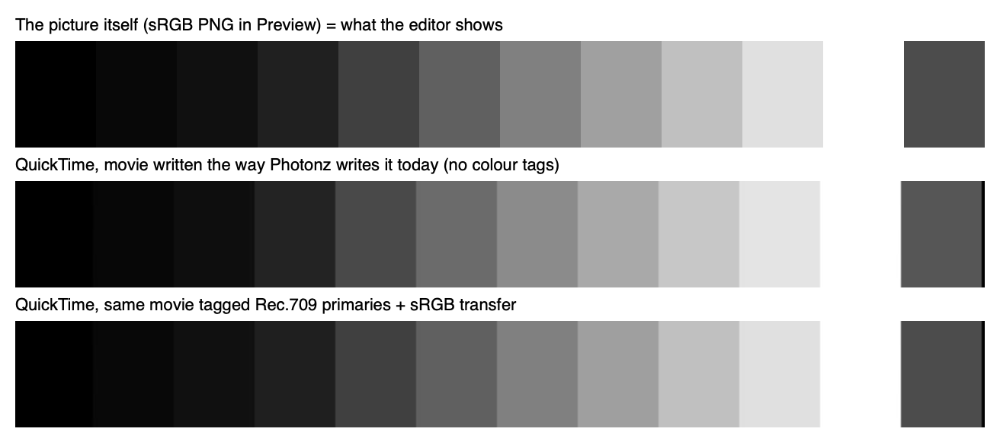

# Does an exported video look brighter than the canvas? Yes.

Answered 2026-10-04 for the task "Find out whether an exported video looks
brighter than the same moment on the canvas".

## The answer

A person playing a Photonz MP4 in QuickTime sees a different picture from the
editor. Mid greys come out lighter, the deepest shadows a touch darker, and
saturated colours shift (pure red plays as a slightly orange red, pure green as
a yellower green). It is the file, not the way the walk read it back.

All three rows are cut from real screenshots of the screen (taken by the probe
app, which holds the Screen Recording grant; Display P3 display, read back in
sRGB code values):

| Written (sRGB) | 0 | 8 | 16 | 32 | 64 | 96 | 128 | 160 | 192 | 224 | 255 | 76 |
| --- | --- | --- | --- | --- | --- | --- | --- | --- | --- | --- | --- | --- |
| PNG in Preview (what the editor shows) | 0 | 8 | 16 | 32 | 64 | 96 | 128 | 160 | 192 | 223 | 255 | 76 |
| QuickTime, untagged (Photonz today) | 0 | 7 | 14 | 35 | 73 | 107 | 139 | 170 | 199 | 228 | 255 | 86 |
| QuickTime, tagged 709 / sRGB transfer / 709 | 0 | 8 | 16 | 31 | 64 | 96 | 128 | 160 | 192 | 224 | 255 | 76 |

Colours, read through Core Image (which matched QuickTime to the code value on
every grey above): written (255,0,0) plays as (231,23,0), (0,255,0) as
(78,255,0), (51,128,230) as (76,141,230). Tagged, all within one code value.

## Why

The movie writer hands H.264 its frames as sRGB pixels and sets no colour
properties, so the file carries no colour tags at all (ffprobe:
`color_range=unknown color_space=unknown color_transfer=unknown
color_primaries=unknown`, checked on a real 1080p export from the probe). The
encoded numbers themselves are right: limited range, 16 + v * 219 / 255, so
sRGB 76 is stored as Y 81.

A player has to guess what an untagged file means. VideoToolbox's guess, which
QuickTime, Safari and the app's own reader all use, is SMPTE-C primaries, the
BT.601 matrix and the BT.709 transfer curve (`ColorInfoGuessedBy:
VideoToolbox` on every decoded frame). Read through the 709 curve, numbers that
were written for the sRGB curve come out lighter in the middle and darker at
the very bottom; read with SMPTE-C primaries and the 601 matrix, colours shift.
That is exactly the walk's pattern: about a tenth brighter at mid grey, a
little darker in the darkest frames of a fade.

Apple's own screen recordings on this Mac are tagged (tv, bt709, bt709, bt709),
so a recording plays in QuickTime as it looks on the canvas, and the same
recording exported by Photonz then plays lighter than either.

Tagging the 709 transfer alone does NOT fix it: a file tagged 709/709/709 with
the same pixels reads 76 as 86 too. What round-trips is Rec.709 primaries, the
709 matrix and the IEC sRGB transfer function in the writer's
`AVVideoColorPropertiesKey`.

## How it was measured

- `docs/progress/media/2026-10-04-export-brightness-write.swift` writes a grey
  strip exactly the way `DocumentMovieWriter` does (BGRA in an sRGB context,
  H.264 through `AVAssetWriter`), untagged or tagged.
- Each file was opened in a fresh QuickTime Player instance and the probe was
  launched with `--capture-diag`, whose first act is a clean screenshot of the
  display. The reference PNG was shot the same way in Preview.
- A real export: `Scripts/playtest.sh` on a three step walk
  (`openSampleRecording`, `startExportAt1080p`, `awaitExport`), then ffprobe.

## Fixed the same day

Both writers now tag their files Rec.709 primaries, the IEC sRGB transfer and
the 709 matrix (`Sources/PhotonzMedia/MovieColour.swift`). The recording's
export also asks its reader for pictures in those colours, since it copies
them straight to the writer: without that a recording tagged 709 / 709 / 709
came out with its greys read through the wrong curve. A real 1080p export from
the probe reads `tv / bt709 / iec61966-2-1 / bt709` in ffprobe, and the fades
walk's MP4 reading now sits within 0.008 of the canvas at every moment it
measures (it used to be about a tenth brighter mid fade), and the walk now
fails if it does not. `Tests/PhotonzMediaTests/MovieColourTests.swift` reads
both writers' files back through VideoToolbox, which QuickTime decodes with.
