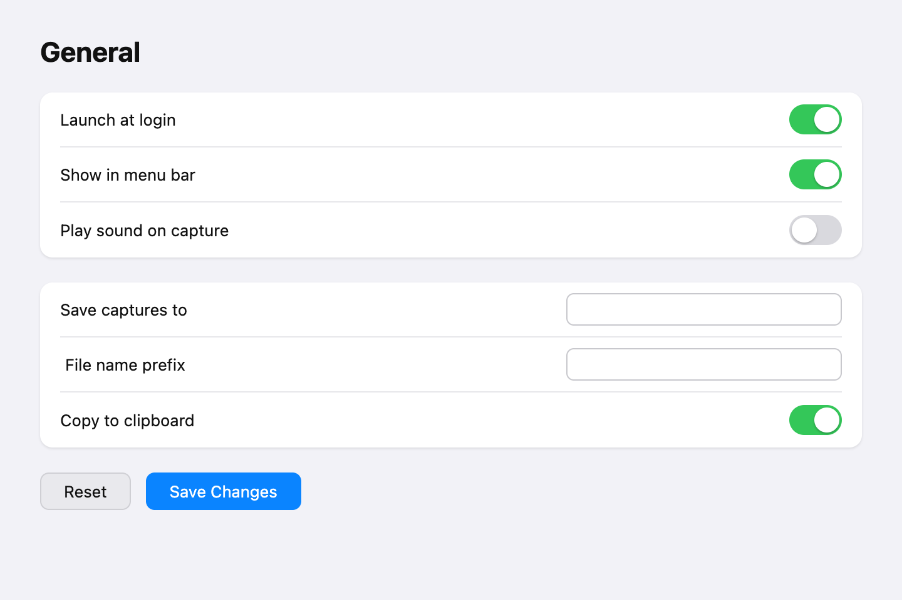
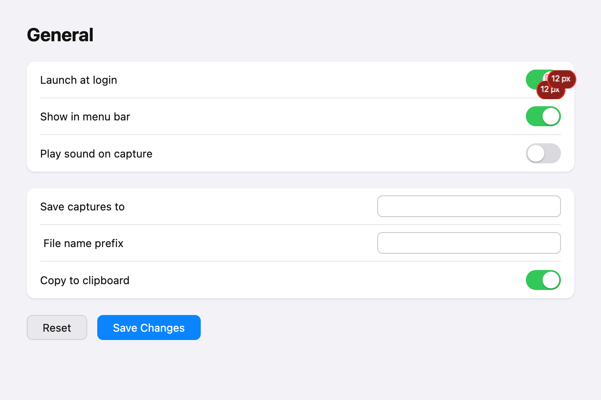
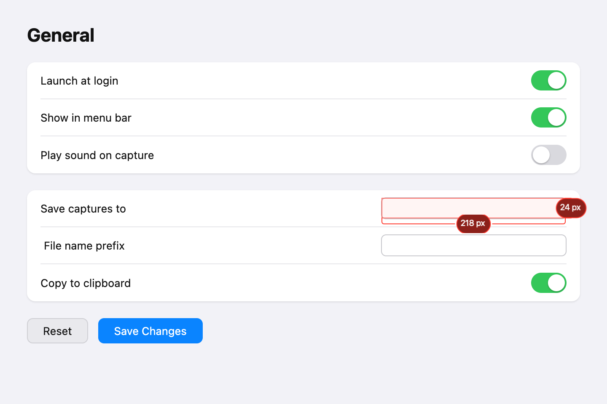
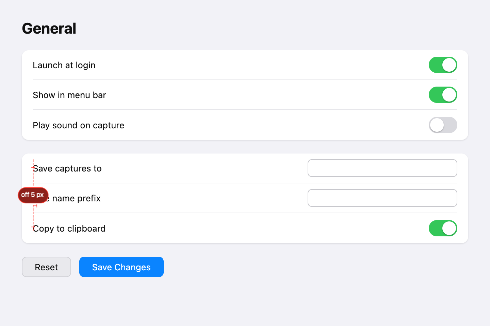
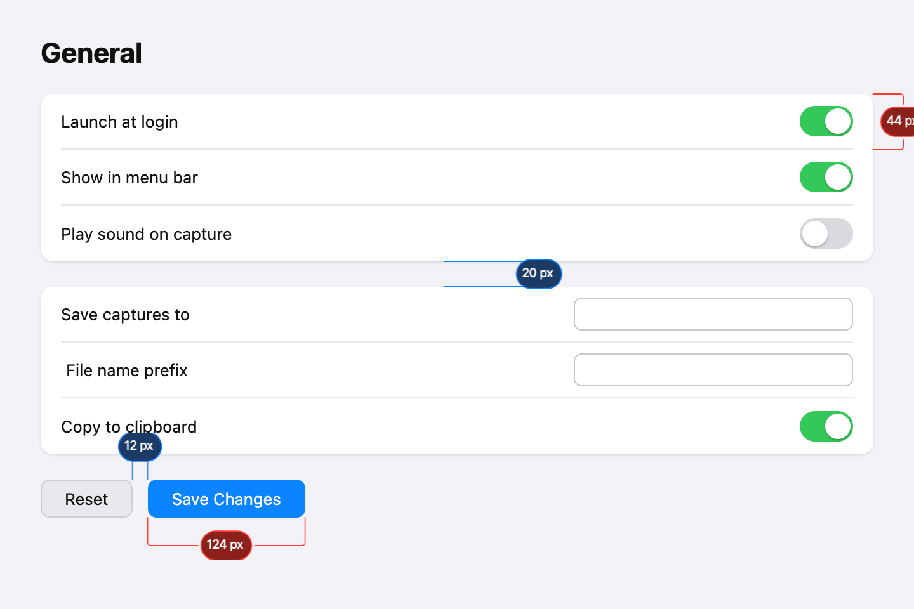
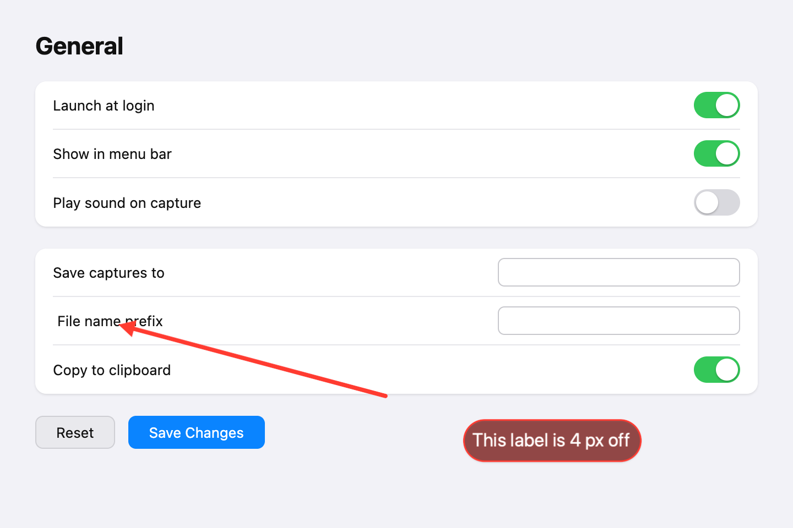

# Measure and redline (Next)

## What it is

Photonz's Measure tool turns a screenshot into a spec. You click two points and
get a caliper with the distance on it; you tag each measurement as a **size**
(red) or a **spacing** (blue) so the sheet reads at a glance; you draw a dashed
**alignment guide** down an edge and it tells you whether everything it crosses
lines up, and which element does not; a **Measurements panel** lists everything
you have marked, and one menu item copies the whole thing out as a plain-text
spec list. Hovering with the tool is meant to read the size of whatever is under
the pointer without you clicking at all, and the arrow tool can now carry a
legible caption pill so a callout does not need a separate text layer.

Six flags carry it, all in the **Next** release and all on by default:
`next-measure-hover`, `next-measure-roles`, `next-measure-panel`,
`next-measure-center-snap`, `next-measure-align`, `next-arrow-captions`.

This matters because redlining a captured UI is the thing Photonz is for. Every
number below was produced by running the shipping code over a real 2x screenshot
of a settings pane whose true sizes are known, so the accuracy claims are
checked, not asserted.

## How to try it

You need about ten minutes and a dev build.

1. Build and launch: `Scripts/build-app.sh` then `open "dist/Photonz Dev.app"`.
2. Open the Experiments window from the menu bar item and set the release to
   **Next**. Leave every `next-measure-*` flag and `next-arrow-captions` on.
3. Save the test capture below to your Desktop (right-click the first image in
   this report, or copy it from
   `queue/audits/2026-08-23-measure-00-capture.png`). It is stamped 144 DPI, so
   Photonz opens it as a 2x Retina screenshot and every readout is in logical
   (design) pixels, which is what you would compare against a spec.
4. Open it in Photonz (File, Open) and press **i** for the Measure tool.
5. **Hover, do not click.** Move the pointer over the empty "Save captures to"
   text field. You should get a tinted outline plus a width and a height
   readout. Now move it over a green toggle, over the blue "Save Changes"
   button, and over a settings row. Watch what happens. This is the part of the
   feature under the most doubt: see "What the adversarial review found".
6. **Measure a size.** Click the left edge of the "Save Changes" button, then
   its right edge, then move up or down to place the caliper and click again.
   It should read **124 px**. The true CSS width is 124.
7. **Measure a gap and re-role it.** Measure the gap between the "Reset" and
   "Save Changes" buttons the same way (true answer: **12 px**). With that
   measurement selected, switch **Role** to Spacing in the inspector. It should
   turn blue and stay blue for the next one you draw.
8. **Snap to a centre.** In the tool options row set **Snap** to
   "Edges and centers", then start a measurement in the middle of a settings row
   away from any line. The foot should jump to the row's vertical centre. Set it
   back to "Edges" and try again: no centre.
9. **Check an alignment.** In the tool options row switch the mode chip from
   **Distance** to **Alignment**, then drag a guide straight down the left edge
   of the three labels in the second card ("Save captures to", "File name
   prefix", "Copy to clipboard"). The middle one is deliberately 4 px out. The
   guide should settle on the two that agree and the chip should say it is off.
10. **Read the panel and copy the spec.** Open the inspector. The
    **Measurements** group lists everything with a colour swatch, a name and a
    value, and the toolbar shows a count pill. Use the group menu,
    **Copy as Spec List**, and paste somewhere. You should get a header line
    plus one line per visible measurement.
11. **Caption an arrow.** Press the arrow tool, drag an arrow pointing at the
    misaligned label, then double-click the arrow and type "This label is 4 px
    off". You should get a dark pill with white text sitting off the arrow's
    tail.
12. **Export.** In the measure inspector's Export section, hit **Copy Image**
    and paste into any app. Every caliper, guide and caption should be baked
    into the pixels.

Here is the capture to use:

## What to evaluate

- **Does hover earn its place?** On this capture it reads an empty field well
  and gets almost everything else wrong (below). Would you rather it were fixed,
  or turned off until it can be trusted? A tool that is right some of the time
  is worse than one that says nothing, because you stop being able to trust the
  numbers.
- **Is red-for-size and blue-for-spacing the right split?** It reads cleanly in
  the picture below, but you have to remember to set the role after drawing.
  Should a gap between two elements auto-detect as spacing?
- **Is the alignment guide worth the mode switch?** It costs a chip in the
  toolbar and a mode you can forget you are in. Is the answer it gives worth
  that, or would you rather just eyeball two calipers?
- **Is "off 5 px" good enough**, when the truth is 4? See below for why it is
  off by one and what it would take to fix.
- **Is the spec list the right shape** to paste into a ticket, or does it need
  the coordinates too?
- **Deliberately left out:** free-angle calipers (still open as decision D2),
  semantic names from text recognition (decided against), and the agent
  "Describe specs" button (decided against).

## What the adversarial review found

Everything below was reproduced by running the shipping code over the capture
above and comparing against the page's real CSS geometry.

### Hover-to-measure mostly does not work, and that is the headline

The promise is "outline the row, button or field under the pointer with a width
and height readout". It only does that when the element is **empty**. The
detector walks outward from the pointer and stops at the nearest edge in each
direction, so as soon as there is text, an icon or a knob inside the element,
it stops on that instead.

- **Empty text field**, truly 220 x 26: reads 218 x 24. Two px short each way,
  because it lands inside the 1 px border.
- **"Save Changes" button**, truly 124 x 30: reads nothing at all.
- **"Reset" button**, truly 72 x 30: reads nothing at all.
- **A toggle**, truly 42 x 24: reads **12 x 12**, a sliver of the white knob.
- **A settings row**, truly 624 x 44: reads 490 x 42, stopping at the label text.
- **Flat background**: reads nothing, which is correct.

Here is the toggle case. The pointer is on the "Launch at login" switch and the
readout is a 12 px square:

And here is the case it gets right, which shows how good this would be if it
worked everywhere:

The two "nothing at all" rows are worth understanding: hovering over text makes
the four directional walks disagree so badly that the resulting box inverts, and
the detector correctly refuses to draw a wrong box. So the quiet-miss rule is
doing its job; the problem is upstream of it.

I did **not** fix this. It is not a tuning nudge. Preferring the strongest edge
in each direction fixes buttons perfectly (124 x 30, exactly right) but then a
settings row grabs the whole card it sits in, because the card border is
stronger than the hairline divider. Preferring the nearest edge is what ships
today and is what breaks on text. Getting both right needs a different signal
than the edge map alone offers, and that is a feature-sized piece of work with
its own fixtures. It is filed as its own task.

### The alignment guide used to settle on empty space; fixed

Drawing the guide down the three labels produced this verdict: reference line at
x 101.8, "off 3 px". Both numbers were wrong, and the dashed line sat 4 px to
the right of every label, touching nothing.

The cause: the reference was the plain median of the crossed edges. The scan
found four edges, two agreeing at 97.5 and two disagreeing at 106 and 108, so
the median averaged the two middle values and invented a line no element sits
on. The spec says the majority defines "aligned"; a median does not deliver that
when the count is even, and a scan that splits one label into two runs can vote
twice.

Fixed in `AlignmentCheck.verdict`: the edges are clustered within tolerance,
each cluster is weighed by how much guide length its elements occupy rather than
by how many items it holds, and the heaviest cluster's mean is the reference. A
genuine tie (two edges, nothing to break it) still splits the difference, which
is what the existing behaviour wanted. Two tests were added, all 934 pass.

The guide now settles exactly on the two labels that agree:

**Still wrong, and named rather than fixed:** the chip reads **off 5 px** when
the true offset is 4. The scan splits the misaligned label into two runs, at
x 106 (the real edge, which would give 4) and a spurious x 108 that spans a
single 8 px stretch below the text. The spurious run is the worst offender, so
it wins the callout. The fix is in the scan, not the verdict: short runs that
no element accounts for should not be items. Filed.

**Also clumsy, not fixed:** the verdict chip sits at the guide's midpoint, which
on a real capture means it lands on top of the element it is accusing. In the
picture the "off 5 px" pill covers the word "File" in "File name prefix". The
one thing the user needs to see is the thing the chip is hiding. Moving the chip
perpendicular, away from the outlier, is the obvious answer, but which side it
should sit on is a look-and-feel call rather than a bug fix, so it is left for
you. Filed.

**And thin:** the aligned elements are marked with 5 px hairline ticks that are
nearly invisible at 100 percent, and there is no count anywhere. The mock showed
"Left edge alignment, 4 items"; the panel row just says "Alignment". You cannot
tell what the guide actually checked.

### Calipers, roles and snapping are accurate and read well

Every distance matched the page's real geometry exactly: button width 124 px,
button gap 12 px, row height 44 px, card gap 20 px. Roles carry their own
remembered ink and the two-colour sheet is genuinely easy to read.

Centre snapping works as specced: dropping a foot 5.5 px from a row's vertical
centre lands on 191.5 against a true centre of 192, and with centres off the same
drag finds no edge at all and falls to the pixel grid. Half a pixel of drift is
the edge map's 16 px block summing, not the snap rule.

Two smaller things in that picture:

- **The height caliper on the right-hand edge is clipped by the canvas.** Its
  head is pushed outside the image, so the chip is cut in half. Measuring
  anything near the right or bottom edge of a capture pushes the readout off
  the picture; you have to drag the head back inward by hand.
- The spec list is honest but terse. Four measurements come out as
  `- Width: 124 px (size)` and so on, with a header line. Two of them are both
  called "Gap", which is fine on the canvas and ambiguous in a pasted list.

### Arrow captions are good

No complaints. The pill takes the arrow's colour, darkens it for the fill,
carries white text and a shadow, and sits clear of the tail.

### What the mock got wrong

- The mock's live caliper rotates to any angle; the shipped one is H/V only.
  Having now used it on a real capture, H/V is right for UI redlining and the
  free-angle version would mostly produce numbers nobody wants. Decision D2 is
  still open; my vote is to close it as "stay H/V".
- The mock's "7 measurements" toolbar pill and the Measurements panel treat
  measurements as a list you curate. On a real sheet of four they are already
  faster to select on the canvas than in the list. The panel earns its place for
  the menu (Copy as Spec List, Clear) more than for the rows.
- The mock never showed a chip landing on top of the thing it labels, because
  the mock's content was drawn around its chips.

## What I could not check here

This run had no Screen Recording or Accessibility grant, so it could not drive
the app's windows or grab live window screenshots. Every picture above is a real
render from the shipping renderer over a real screenshot, which covers the
canvas half of the feature completely. The **chrome** half — the toolbar mode
chips, the Snap and Show menus, the Measurements panel rows, the count pill and
the Export buttons — was verified by reading the wiring and by the unit tests,
not by looking at it. Step 5 onward in "How to try it" is aimed at exactly that
gap: when you run it, the chrome is the part worth your eyes.
