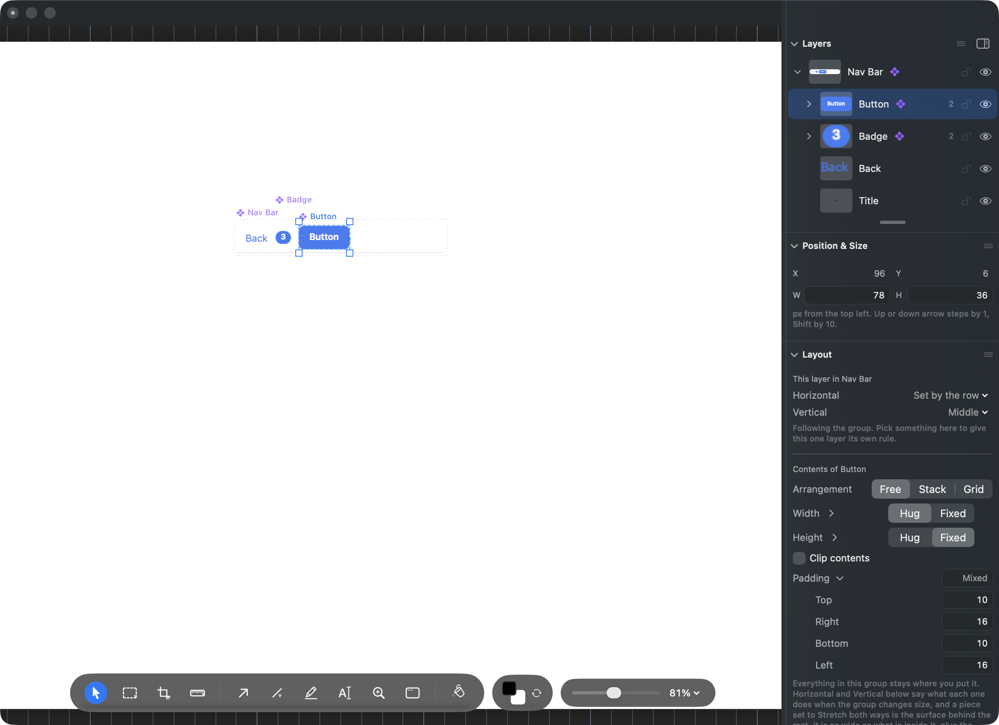

# Where should a nav bar's title sit once the bar has controls on it?

## What this is about

The Library shelf ships with five ready-made pieces you can drag onto the
canvas: a Button, a Text Field, a Card, a **Nav Bar** and a Badge. They are a
starting point for building UI, not real macOS controls.

The Nav Bar arrives as a small bar, 320 points wide and 48 tall: a white
surface, a hairline along its bottom edge, a blue **Back** label at the left,
and the word **Title**.

Since last week the bar arranges itself. Drag it wider and the back label holds
the left edge, the hairline stretches across, and the title stays in the middle.
Since this week you can also step inside the bar and drag more pieces onto it
from the shelf, and the bar lines them up for you.

That is where it goes wrong.

## What happens today

The title is not one of the things the bar lines up. It lies **across the whole
bar** and centres its words on the bar's exact middle, and it is drawn
underneath the controls so that a click meant for the Back label still reaches
the Back label.

The controls, meanwhile, pack in from the **left**. Back, then the next one,
then the next one. So the third piece you add reaches the middle of the bar and
parks on top of the word Title, and the title is gone with nothing on screen to
say where it went.

You can see it happen. Real numbers from the bar as it ships, after a Badge and
a Button joined it:

| Piece | Where it sits across the bar |
| --- | --- |
| Back | 14 to 50 |
| Badge | 58 to 81 |
| Button | 93 to 172 |
| the word Title | about 145 to 175 |

The Button and the title are in the same place, and the Button is on top.

This is not a fault in the drop. It is the shape of the bar: one row packing
from the left, one title lying across the whole width. They were always going
to meet.

## Try it yourself

In Photonz Dev, release Next, open a blank document and the Library.

1. Drag the **Nav Bar** tile onto the canvas.
2. Double click the blue **Back** label. You are now inside the bar.
3. Drag the **Badge** tile onto the bar and let go.
4. Drag the **Button** tile onto the bar and let go.
5. The word Title is now behind the Button.

## The three ways out

### A. The title takes the room that is left  (recommended)

The title stops lying across the bar and becomes one of the pieces the row
lines up. It sits after the back label and takes whatever room is left over,
centring its words in that room.

What you would see: on a bar with just a back label, the title sits a little to
the right of the bar's exact middle, about 24 points over. Add a Badge and a
Button on the right and the title's room shrinks from the right, so the words
slide left and stay clear. Nothing is ever covered.

There is a bonus. Because the piece you drop goes where you let go in the row,
letting go on the **left** half puts a control before the title and letting go
on the **right** half puts it after. So the bar gets a left end and a right end
for free, without you setting anything up.

The price is that a nav bar title on iOS or macOS sits on the exact middle of
the bar, and this one would not.

### B. The bar keeps its middle

The title holds the exact middle of the bar for good, and the controls stop
crossing it. Let go on the left half of the bar and the control joins the left
end. Let go on the right half and it joins the right end.

What you would see: exactly the bar you have today, plus controls that gather
at the two ends and a title that never moves.

The price is that this is more to build, so it lands later, and that inside the
bar you would find a left group and a right group in the layers list rather
than a flat list of pieces. The starter set is deliberately plain, so that is a
real cost, not a detail.

### C. Leave the bar as it is

The title goes on lying across the bar underneath the controls, and a bar with
two controls on it has no visible title. You would move or delete the title
yourself when it gets in the way.

Picking this retires the task for good.

## Why A is recommended

A is the shortest thing that makes the bug impossible rather than unlikely, and
it is already proven to work: the layout has everything it needs, so nothing
new has to be invented. It also hands you the left end and right end behaviour
that B builds on purpose, as a side effect of the drop rule that already
shipped.

B is the prettier bar at rest, and if a centred title matters more than a plain
starter, it is the right answer. It costs a nested bar and a later landing.

## Where to look

- The bar and the four pieces it is made of: `Sources/PhotonzCore/StarterComponents.swift`
- The audit that first found this: `queue/audits/2026-09-06-drop-into-open-group.json`, last line of `rough`
- The audit that first asked the question: `queue/audits/2026-09-05-nav-bar-row.json`, first line of `evaluate`
- The dashboard: http://127.0.0.1:8791
