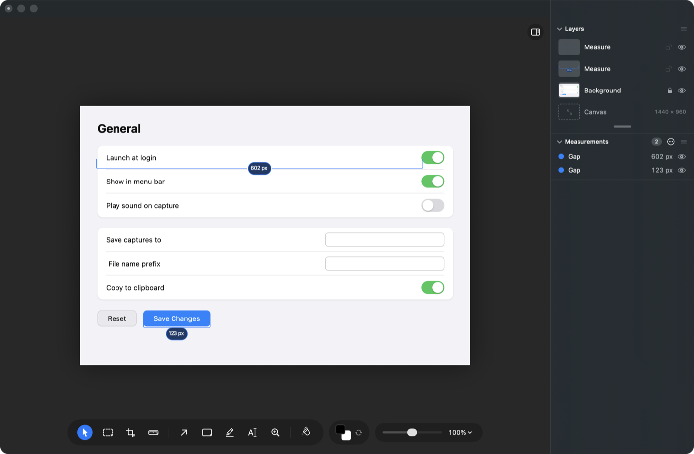
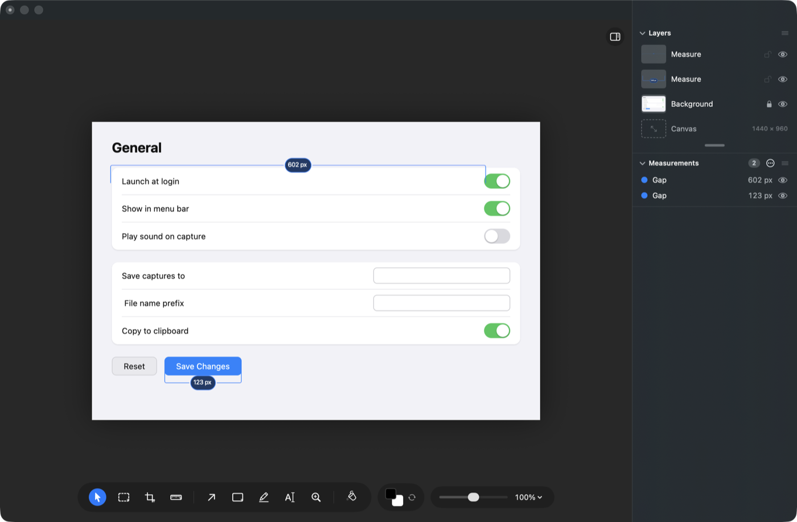

# Distance: should letting go finish the measurement?

## What this is about

The Measure tool in Photonz Next has four things it can do, and you pick one in
the tool button: **Distance**, **Size**, **Gap**, **Alignment**.

Three of them cost you one action:

- **Size** — click a button and you get its width and height.
- **Gap** — click the space between two things and you get the spacing.
- **Alignment** — drag a guide down an edge and it reports what lines up.

**Distance** is the odd one out. It is the free two-point measurement, the one
you reach for when nothing on screen is quite the shape you want to measure, and
it costs three clicks: one on the first point, one on the second, and a third to
park the number somewhere it does not sit on top of what you just measured.

That third click made sense when nothing else could decide where the number
should go. That is no longer true. The same code that puts a Gap's number in
clear space now also knows what a two-point measurement's feet landed on, and
keeps the number off those things. So the third click is doing a job the app can
already do.

## What each option looks like

Both pictures below are the real app, same capture, same two measurements: the
width of the Save Changes button (123 px) and the width of the first settings row
(602 px). The measurements come out identical either way. The only thing that
changes is how many actions it took and where the number ended up.

### Let go and it lands (recommended)

Press on the first point, drag to the second, let go. Done. The number is already
placed.

Clicking each point still works, and the second click finishes the measurement
rather than starting a wait for a third. The pill above the tool bar reads
**Drag between two points, or click each one**.

If you do not like where the number went, drag the number. That already works
today: pulling it away from the line deepens the measurement's arm and takes the
number with it, and pushing it along the line slides just the number, lining it
up with the other numbers on the picture.

### Let go and it lands, unless you hold Option

Identical, except that holding Option as you release keeps the number on the
pointer waiting for a click, which is today's third click. Fast by default, old
behavior on demand.

Worth knowing before picking this: a similar offer was already turned down on
this tool. Asked whether measurements should be able to run at any angle with a
held key, the answer was no held key, keep the one simple behavior.

### Keep the three clicks

Nothing changes.

Compare the two pictures: in this one the 602 px number sits above the row
because that is where the third click went, and in the other it sits below
because that is where the app found clear space. Both read fine. The question is
whether choosing that yourself is worth the extra click every single time.

Picking this option retires the task; nothing gets built.

## What is already built

The drag itself is working in the app right now, behind a switch that is turned
off, so Next behaves exactly as it always has until you choose. The pictures
above are that build. If you pick the plain drag, the switch flips and the tool's
wording follows it. If you pick the Option variant, the held key gets added on
top of the same switch.

## What does not change either way

- The measurement stays straight, horizontal or vertical, as you chose earlier.
- The tool hands back to the arrow after each measurement, as you chose earlier.
- The number reads the same and the measurement snaps to the same edges. The two
  gestures were checked against each other on the same capture and produced the
  same numbers.
