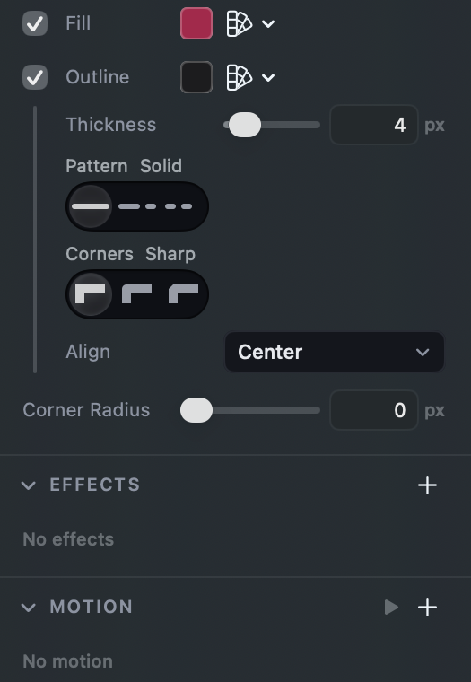
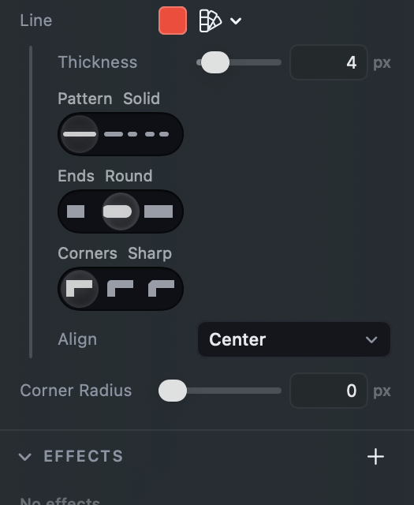

# Width and Caps, or Thickness and Ends

## What this is about

When you pick a shape you drew with the Pen, the settings panel shows its
outline settings under the **Outline** row in Appearance: how thick the line
is, what pattern it has, what its ends and corners look like, and which side
of the edge it sits on.

The icon drawing mock draws the same settings as a **Stroke** section with
three rows: **Width**, **Caps** and **Align**. See it at
[the icon drawing mock](http://127.0.0.1:8791/index.html#icon-draw-wt), step 9
("Give it the set's weight").

## What the app shows today

A closed path (a triangle drawn with the Pen):

An open path (a line drawn with the Pen):

## Where it differs from the mock

| Mock | App today |
| --- | --- |
| **Width**, a dropdown reading 1.75 | **Thickness**, a slider with a typed number |
| **Caps**, the words Butt, Round, Square | **Ends**, three small pictures of a line end |
| Caps shown on every path | Ends shown only where there are ends to see (an open path, or a dashed one) |
| **Align**, a dropdown reading Center | **Align**, the same dropdown, same words: matches |

The app also offers **Pattern** (solid, dashed, dotted) and **Corners** (the
mock's "round joins"), which go further than the mock and are not in question.

The heading (an Outline row in Appearance rather than a Stroke section) follows
your call on 2026-09-06 that each part of a shape is a row with its settings
under it.

## Why this is a question and not just a fix

Thickness and Ends are not path words. Lines, arrows and boxes use the same
two words for the same settings, and twelve playtest walks read them. Renaming
for paths alone means the same setting has two names depending on what you
picked.

## The options

- **A. Width and Caps on every shape, Caps as words.** One vocabulary, the
  mock's. Every outline says Width and every line end says Caps, with the words
  Butt, Round and Square. Width stays a slider with a number you can type.
  Caps stays hidden on a closed solid shape, where the setting would change
  nothing on the canvas (the mock shows it there; this is the one place we would
  still differ, and picking A accepts that).
- **B. Width and Caps on paths only.** The icon panel matches the mock exactly;
  redline lines and arrows keep their words. Two names for one setting.
- **C. Option A, plus Width as a dropdown of icon weights for a path.** Common
  icon weights (1, 1.5, 1.75, 2, 2.5, 3) in a list you can also type into,
  as the mock draws it. Quicker to hit a set weight, slower to try weights by
  eye, and a path's Width would work differently from an arrow's.
- **D. Keep Thickness and Ends.** Nothing changes. This retires the task.

## Recommendation

**A.** It brings the mock's words in without splitting the app's vocabulary,
and Width and Caps are what a Figma or Illustrator user looks for. A slider
with a typed number already takes 1.75 in one go, so the dropdown in C buys
little for what it costs.
