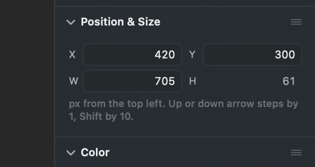
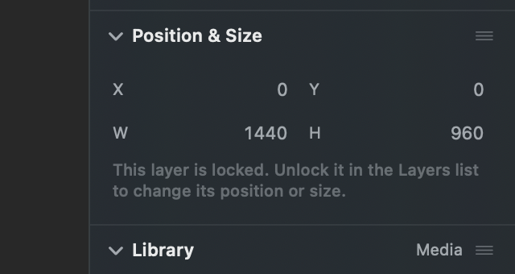
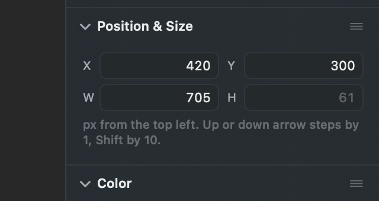
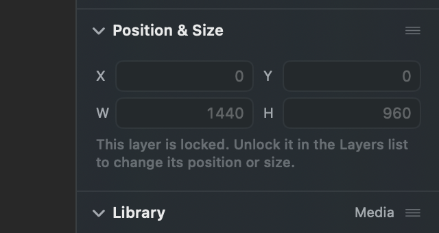

# A number you cannot type into, in the Position and Size panel

## What this is about

Pick a layer in Photonz and the right hand panel shows a section called
Position and Size: four numbers, X and Y over W and H, each in its own small
rounded box. You click one, type a number, press Return, and the layer moves or
resizes.

Some of those numbers are not yours to type. The app worked them out:

- **A piece of text has no typeable height.** Its height is whatever the words
  came out to once they wrapped. You change it by changing the width, or the
  font size.
- **A locked layer has no typeable anything.** All four numbers are just where
  it happens to sit.
- **A row inside a stack has no typeable position.** The stack decides that.
- **A copy of a component has no typeable size.** It is the size of the original.
- **A line, an arrow or a caliper has no width or height to show at all**, because
  its box is padding around a stroke rather than the shape you drew.

Today every one of those still wears the same rounded box as the numbers you
can type. The number inside is a little greyer, and that is the entire
difference. So you click it, nothing happens, and nothing tells you why until
you have hovered long enough for a tip to appear.

## What already changed, whichever option you pick

Clicking one of these numbers now answers immediately. The line under the four
fields, which normally explains what the numbers mean, swaps to the reason for
about six seconds and then goes back:

> Height follows the text. Change the width to re-wrap it, or the font size in
> the Text section.

That part is not up for decision and is already in. What is up for decision is
the look.

## Option A: plain number, no box

The number sits as plain grey text exactly where its box used to be. Same
letter in front of it, same column, same row height, so nothing shifts.

A piece of text, where W takes typing and H does not:

A locked layer, where none of the four takes typing:

## Option B: keep the box

What is there today. Every number keeps its rounded box and the greyer text is
the only thing telling the two kinds apart.

The same piece of text:

The same locked layer:

## The one thing to look at

The locked layer is where the two options are furthest apart. In B it is four
boxes that all look ready for a number and none of them are. In A it reads as a
plain statement of where the layer sits, which is what it is.

The place A costs something is an arrow or a line, where there is no width or
height to show at all: instead of an empty box you get a lone W with nothing
after it. That is honest, but it is emptier.

## Trying it yourself

Both looks are built. Open the Experiments window, pick the Next release, and
turn on **Numbers you cannot type stop looking like ones you can**. It is off
until you choose, so the app you have is showing Option B.
