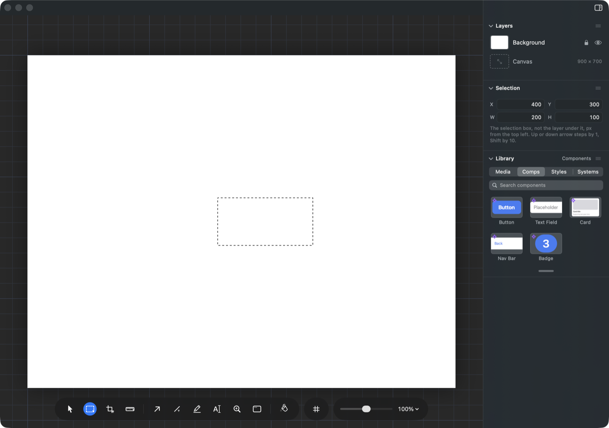
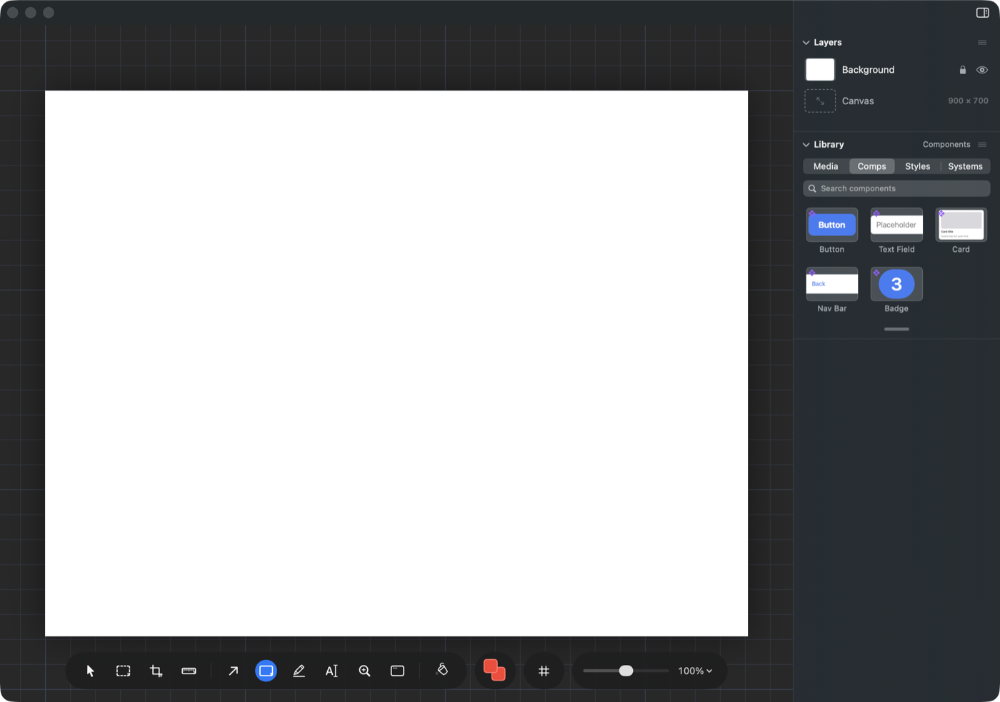
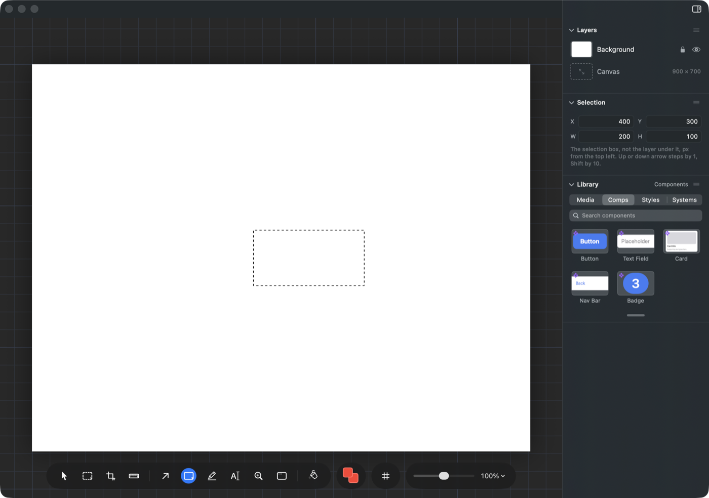
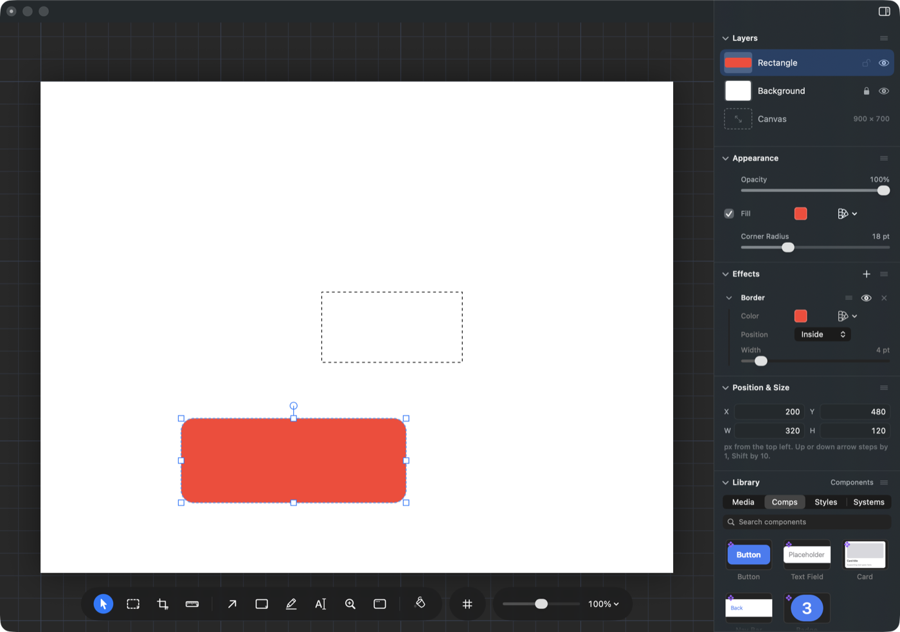

# When you pick up a paint tool, what should happen to the marquee?

## What this is about

A marquee is the dashed box you draw with the marquee tool (press **M**). It is
how you say "this part of the picture": you fill it, you cut it, you copy it,
you nudge it a pixel at a time with the arrow keys, and while it is up the
panel on the right shows its exact X, Y, width and height so you can line it up
to the number.

Here is one, just placed:

Now press **R** for the rectangle tool. This is what you get:

The outline is gone, the Selection numbers are gone, and **Command Z does not
bring them back**. It steps to your last edit to the picture instead. So a
box you spent a minute lining up is thrown away by one keystroke, and there is
nothing you can press to get it back.

That is the same for the rectangle, ellipse, arrow, line, highlighter, text,
crop, measure and zoom tools. The pointer, the marquee family and the paint
bucket all keep it.

## Why it works this way today

The thinking was that a dashed outline is select-mode furniture: if it is still
crawling while you hold the rectangle tool, it looks like it is going to do
something, and it is not. Anything you draw with the rectangle tool is drawn
over the whole canvas, not confined to the box.

## What you would experience under each option

### It stays up

The outline stays wherever you left it, whatever tool you pick up. This was
built and photographed before writing this, so the picture below is the real
app, not a sketch. The rectangle tool is in hand and the outline is still there:

And after drawing a shape with it. The new shape wears a blue outline with
handles; the marquee keeps its own black and white dashes, well apart from it:

This is what Photoshop does. The outline hangs around until you clear it, and
people use it as a landmark while they work on something else.

### It goes, and one undo brings it back

The screen stays as quiet as it is today, but losing the outline becomes an act
you can take back. Press Command Z once: the outline is back, and so is the
tool you were holding when you drew it. Press it again and you are on your last
edit to the picture. Redo puts you back into the paint tool.

The catch is that one press of Command Z would be changing two things, the
outline and the tool in your hand. The app does already do this after a paste.

### It waits out of sight

The outline is kept but hidden while a paint tool is in hand, and fades back in
when you pick the pointer or the marquee up again. Command Z is never spent on
it. The risk is that you would reasonably believe it was gone, and be surprised
when it comes back.

### Leave it as it is

Nothing changes and the outline stays lost for good.

## Recommendation

**It stays up.** It is the shortest thing to build, it is what the app already
says it does inside the selection family ("Photoshop keeps the ants up" is the
reason written next to the current rule), and it removes the whole question of
what Command Z should mean here rather than answering it. The one cost, an
outline on screen that your next brush stroke will not respect, is a cost every
other editor of this kind decided was worth paying.
