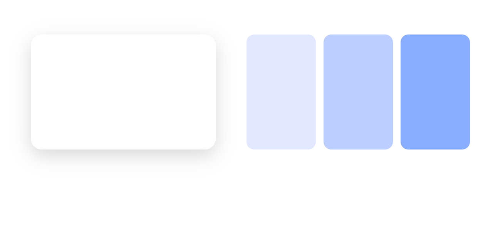

# Photonz draws see-through things lighter than a browser does

## What happened

Someone put a soft shadow on a card, exported the drawing, and the shadow in
the file came out visibly darker than the one they had been looking at. That is
real and it is measurable: sampled in the middle of the shadow, the canvas draws
224 where the exported file draws 190, out of 255.

Chasing it turned up something wider than shadows. The app mixes ANY see-through
thing more lightly than the rest of the world does:

| What you set | What Photonz draws | What a browser, Figma or the exported file draws |
| --- | --- | --- |
| 50% black over white | 188 | 128 |
| 50% blue #0A84FF over white | 190, 199, 255 | 151, 181, 255 |

So it is not only a shadow that comes out wrong. It is the opacity slider, every
see-through fill, every scrim, and every shadow, because a shadow is see-through
by definition.

## What it looks like

The same little scene, drawn both ways. A white card with a soft shadow under
it, and the same blue at a quarter, a half and three quarters strength.

**Photonz today**

**Matching the web**

Two things are worth looking at. The shadow: today it is a faint smudge, and the
one on the right is the shadow that was actually asked for. And the washes: at a
quarter strength today's blue has gone grey-lavender, where the one on the right
is still blue.

## Why it matters beyond the export

Photonz is for building UI. A mock built here is built to be handed to somebody
who will draw it in a browser, and a browser mixes colours the way the picture
on the right does. Today a shadow tuned until it looks right in Photonz is a
shadow that will look heavy everywhere else, and a translucent overlay picked
here is a different colour once it ships.

## What each answer means for you

**Match the web.** Everything see-through draws the way it will draw once it
leaves the app. Drawings you already have will look different when you open
them: shadows deeper, washes stronger and more colourful. Nothing is lost, but
anything tuned by eye was tuned against the old mixing and may want a second
look. This would land in the Next release only, so the Photonz you have open
today keeps its current look and you can open the same drawing in both.

**Keep today's look, send shadows out as a picture.** The canvas never changes.
Instead the exported file gives up on drawing shadows out of shapes and puts a
flat picture in the file for any layer wearing one. The file then matches the
screen exactly. The cost lands on whoever receives the icon: a picture cannot be
recoloured, and it goes fuzzy when scaled up, which is most of the reason to
hand over an SVG at all.

**Leave it alone.** Nothing changes. An exported shadow stays darker than the
one you approved, and the difference gets written into the export notes so it is
at least documented. Picking this retires the task.

## The recommendation

Match the web. The export mismatch is the symptom; the app disagreeing with the
browser about what 50% means is the actual problem, and it is the one that costs
the most in a tool whose job is building UI. Scoping it to Next means today's
Photonz is untouched while it is judged.
