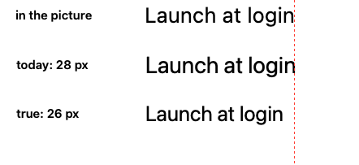

# A size read off a screenshot, and the two answers it has

## What this is about

Photonz can take a screenshot apart into layers and then read the labels in it
back into real, editable text. Once it has, you can pick a label and the Text
section on the right tells you its font, its weight and its size. That Size menu
is how you get a number off a screenshot, and a number off a screenshot is what
a redline is written from.

You can see it in the app: open a settings pane capture, separate it, press
Read the Words, pick the six row labels, and the Size menu says **28 px**.

## What we found

Those labels are 13 point type, photographed on a Retina screen, so the picture
has two pixels for every point of them. Opened here, one of those pixels is one
of the document's own points, so 13 point type is **26** of them. The menu says
28. Every label on the page is high by the same amount, between 6 and 11 per
cent depending on the words.

The measurement itself is not the problem. Set type at a size we choose,
photograph it, and read it back at the scale it was photographed at, and the app
lands within 1.2 per cent, every size, every face, 1x and 2x. Read the real
settings pane that way and its rows come back at exactly 13.00 points; read the
Effects panel that way and its rows come back at exactly 10.00. Whole numbers,
which is what a real settings row is set at. The app knows.

## Why the two numbers differ

The system font is not one drawing. It carries an optical size, and macOS
applies it: **SF Pro at 13 points is a wider, looser drawing than SF Pro at 26**.
Set "Launch at login" at 13 points and photograph it at 2x and it is 182 pixels
of ink wide. Set the same words at 26 points and draw them at 1x, which is the
same em in the same number of pixels, and they are 168 pixels wide. 7.7 per cent
apart. Helvetica Neue and SF Mono, which carry no optical size, come out pixel
for pixel identical both ways.

So a 13 point label photographed at 2x cannot be reproduced by any point size.
28.4 covers the same pixels. 26 is the size the type really was. Both are true
about different things, and today the app reports the first and calls it the
size.

The red rule is where the picture's letters end. The middle row is what the app
does today, landing on it exactly. The bottom row is the true size, 13 pixels
short over a label 182 pixels wide.

## What each choice feels like

**Say the size the type really was.** The Size menu reads 26 px. Retyped words
come out like the bottom row above: a little shorter, a little smaller. Read a
whole page in one press, which is what the command does, and every label shrinks
together, so the page stays even with itself. Read only some of them and the
read ones sit a hair smaller than the rest.

**Keep the words on the ink, and say the picture's size under the menu.**
Nothing on the canvas moves. Under the Size menu, on labels read off a Retina
screenshot only, one line says what size the type in the picture was. You get
the true number without giving up the exact overlay, at the cost of two size
numbers on one label.

**Open Retina screenshots at their real size.** The deepest fix. A 2x screenshot
opens as an 800 by 600 canvas instead of 1600 by 1200, with all its pixels still
there and still sharp. Then 13 point type is 13 of the document's points, the
Size menu says 13 px, the retyped words land exactly, and every other readout in
the app, every gap and every margin, becomes the number you would write in a
spec rather than twice it. The catch is that export has to be taught to keep all
the pixels, or a capture comes back out at half the size it went in.

**Leave it as it is.** The menu goes on saying 28.

## Where the measuring lives

`Tests/PhotonzRenderTests/ReadSizeGroundTruthTests.swift`. It sets type at
sizes it chooses, photographs it, reads it back, and pins both the accuracy and
the gap, so whichever way this goes the change can be seen to have worked.
