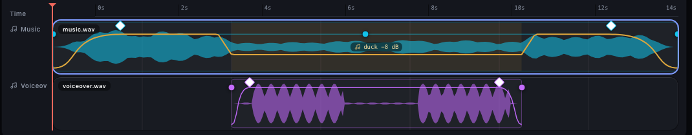
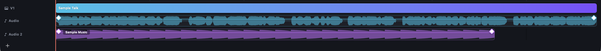
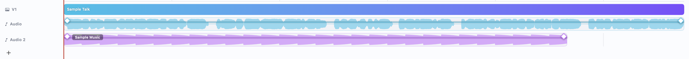
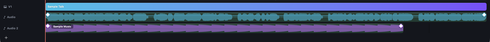
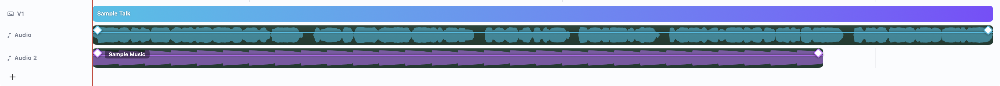

# Which background should a sound clip wear on the timeline?

## What this is

When a recording has sound, the timeline under the video shows the sound as a clip on an Audio track, and any music you add gets its own track below. Each sound clip draws its waveform (the shape of the sound) and a level line you can drag.

Your two mocks draw that clip differently:

- The main editing mock ([video.html](http://127.0.0.1:8791/index.html#video)) draws it as a solid **dark green** block.
- The audio mock ([video-audio.html](http://127.0.0.1:8791/index.html#video-audio)) draws it on the **panel colour** with a thin edge in the track's colour, so the coloured waveform is what you see.

Both are built. The pictures below are the real app, the talk sample with the sample music added.

## The audio mock's lanes

## Option A: panel colour, coloured waveform

Dark:

Light:

The waveform carries the colour: cyan on the first sound track, purple on the second. The clip's outline is a thin line in that colour.

## Option B: green clip, as today

Dark:

Light:

Every sound clip is a solid green block, and the coloured waveform sits on the green.

## What stays the same either way

The waveform shape, the level line, the fade diamonds, the music's name tag and the blue ring round a picked clip are identical in both. Only the clip's background and edge change.

## Try it yourself

Option A is in the app now as the switch **Sound clips on the panel colour** in the Experiments window (Next). Turn it on and look at any recording with sound.
