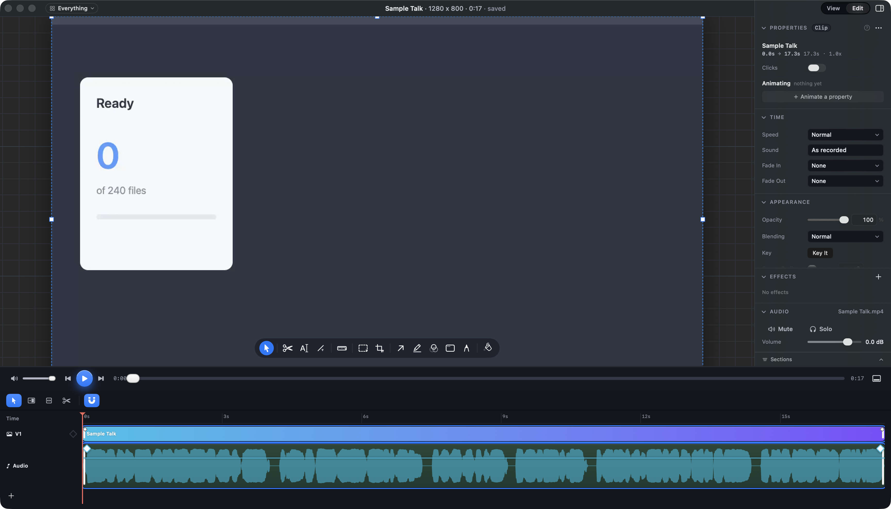
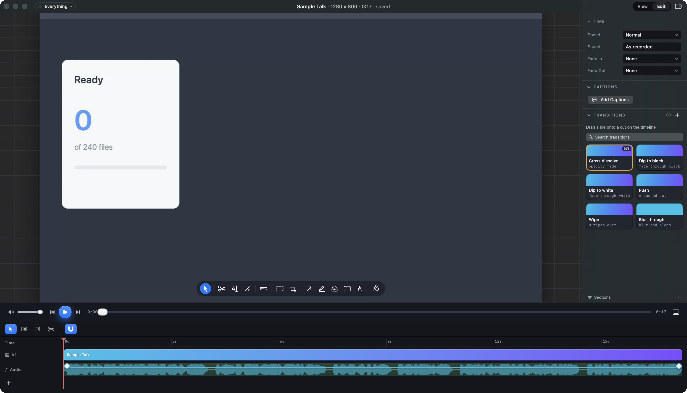

# How tall should a sound's lane be on the timeline?

## What this is about

When you open a recording with sound, the timeline under the picture shows the
video on a track called V1 and its sound on a lane underneath, called Audio.
That lane draws the waveform (the shape of the sound) and the level line you
drag up and down to make it louder or quieter.

Two of your mocks draw that lane at different heights:

- **The audio mock** ([video-audio.html](http://127.0.0.1:8791/index.html#video-audio))
  draws each sound lane **84 points** tall, 72 when the window is 880 points
  wide or narrower.
- **The main editing mock** ([video.html](http://127.0.0.1:8791/index.html#video))
  draws every lane, sound included, **28 points** tall.

Today the app draws it 34 points tall.

## What has already shipped

The waveform is now one smooth filled shape in the lane's own colour (cyan on
the first sound track, purple on the second), and the level line is drawn in
that colour as well, as the audio mock draws them. That is the same at any
height, so only the height is open.

## What you would see

### a. 84 points, as the audio mock (recommended)

The sound lane is 84 points tall (72 in a narrow window), and the track name sits
at the top of it, as the mock places it. The timeline opens 50 points taller
on every recording with sound, so the picture above it is about 50 points
shorter. With music on a second track the two sound lanes fill most of the
timeline, and the rest scrolls.

You get a waveform you can read a fade and a pause in, a level line with more
than twice the room to drag, and a fade diamond that no longer sits on top of
the line.

### b. Compact, as the editing mock

Nothing moves. The sound lane stays 34 points with the new smooth shape and
coloured line. To work on the sound in detail you pinch the timeline with Shift
held, which grows every row together, up to four times. Choosing this closes
the task, since the rest of it has shipped.

### c. Compact until you pick a sound

The lane is 34 points until you click the sound's clip, then opens to 84 while
it is picked and closes when you pick something else. The picture keeps its
height until you work on sound, but the timeline and the picture change height
every time you pick or unpick a sound.

## Why a runner did not just pick one

The audio mock is the more specific page, but the 50 points come out of the
picture on every recording, including ones where you never touch the sound,
and the editing mock draws it the other way. That tradeoff is yours.
