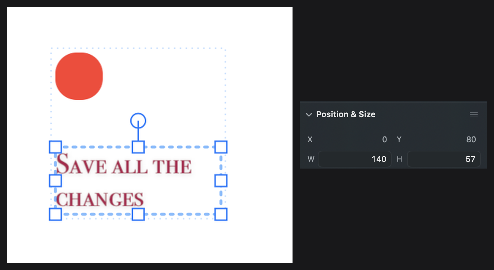

# A wrapped label and the two widths it has

## What this is about

Photonz can put a ceiling on how wide a box may get. Give a stack a **Largest
width** of 140 and it stops there. A line of words inside it that wanted to be
260 wide does not hang out of the edge any more: it breaks onto a second line
and the box grows downward instead.

That part works. The question here is what the label is then, because after a
wrap it has two widths, and only one of them is on screen.

- **The room it was given.** 140, the whole width the stack allowed it.
- **The words that came out.** The longest line the wrap produced, which is
  shorter, because words only break between themselves.

Today the label takes the room. Pick it and W says 140.

## What you see today

That is the app, not a drawing. A square and the words "Save all the changes"
in a column stack, Largest width 140, the label itself picked. Its selection
outline and its handles run the full 140. The longest line, "Save all the",
stops about 29 short of the right-hand edge. W says 140.

So the number in the panel and the picture on the canvas are saying different
things about the same label, and a person writing a spec off it cannot tell
which of the two they have.

[The whole window, same moment](a-wrapped-label-says-which-width-you-are-looking-when-words-are-wrapped-to-fit-th-window.png)

## What each choice would feel like

### A. Fit the words

The moment the wrap happens, the label's box tightens onto the longest line.
The outline in the picture above would close in on "Save all the", and W would
read about 111 rather than 140.

Anything around it that hugs its contents tightens too, so the stack in the
picture, held at a Largest of 140, would settle at what its wrapped words need.
The ceiling is still a ceiling; the box just stops asking for room it does not
use.

A label picked anywhere in the app then means one thing: W is how wide the
words are. That is the number a redline wants.

The cost is that you can type 140 into Largest and get a box that is 111, which
takes a moment to read as "it never needed the other 29" rather than "it
ignored me". A label that is aligned left inside a box wider than itself also
moves by those few points, once, when its box tightens.

### B. Keep the room, and name both numbers

Nothing on the canvas moves. The label stays 140 wide, exactly the room the
stack gave it, and a line appears under W and H saying what that number is and
what the other one is: wrapped to fit Group, words 111 wide.

Both numbers become readable without changing a single layout that already
looks right. What it does not fix is the picture: the selection outline still
runs past the last letter, so the thing your eye measures and the thing the
panel says still differ, and now the panel explains the difference instead of
removing it.

### C. Leave it as it is

A wrapped label goes on reporting the room it was given. Anyone who wants the
real width of the words drags the measure tool across them.

## Where to look

The behaviour is in Next, on by default. To see it for yourself: draw a small
square, type a sentence under it with the text tool, pick both, choose
**Layer > Stack Selection**, open the Layout section's **Width** chevron, and
type 140 into **Largest**. Then open the group in the Layers list and pick the
label inside it.

Nothing in the design mocks drew this. It comes out of the wrap feature's own
audit from 2026-09-05, which flagged it as "two numbers that look like they
disagree".
