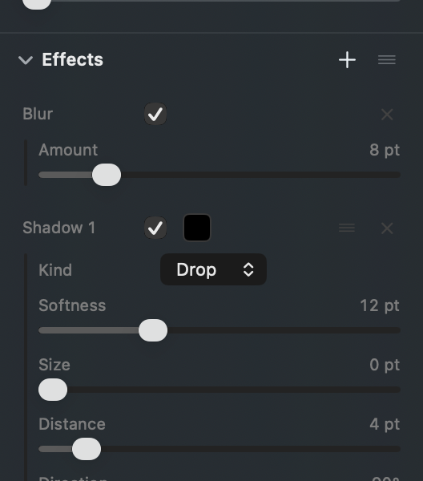
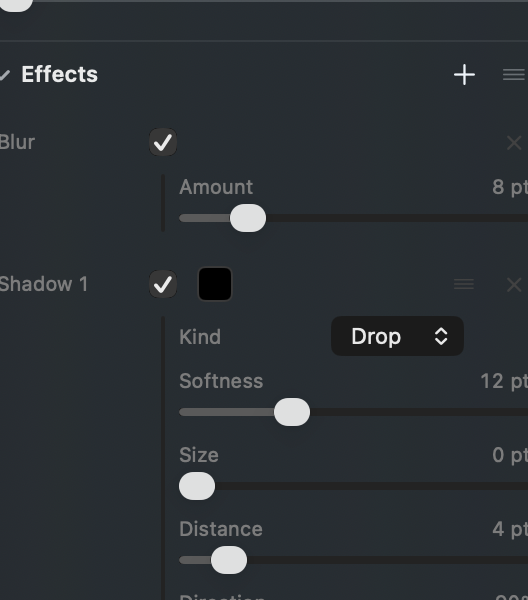
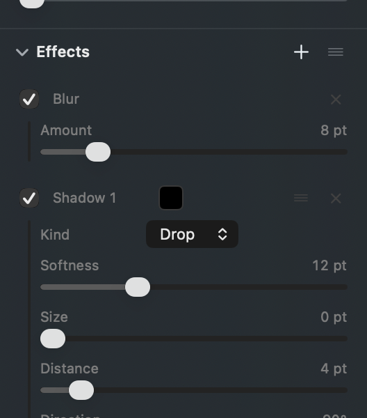
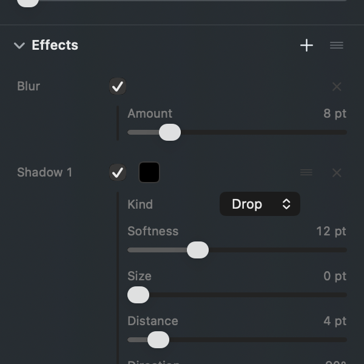

# The rule beside an effect's settings, and the tick it should hang from

## What this is about

Pick a shape in Photonz and the right hand panel shows two lists. **Appearance**
is what the shape simply has: its opacity, its fill, its outline, a corner
radius. **Effects** is the list you add to: a blur, a shadow, another shadow.

Rows in both lists work the same way. A row has a name, a tick that switches it
on, and a colour. When the row is on, its own settings appear underneath it with
a faint vertical rule down their left side. The rule is there to say "these
belong to the row above": without it, a shadow's Blur and the layer's own Blur
read as the same control twice, which is what was reported on 2026-09-07.

The rule currently starts at the panel's left edge. The tick is about 81 points
further in. So the two never share a line, and the rule reads as a second column
that happens to start under the row rather than as something hanging off it.

*Today. The rule is the faint line at the far left; the tick is way over beside
the word Blur.*

## Why this is not just a nudge

The obvious fix is to slide the rule right until it is under the tick. That was
built and photographed, and it does line up exactly. But the settings then have
81 points less room to live in, and they do not fit: at the panel's normal width
the whole row spills past both edges, the name is clipped on the left, the value
is clipped on the right, and the cross that removes an effect is pushed off the
window where it can no longer be clicked.

*The straightforward fix, at the panel's normal width. Blur is cut off on the
left, 8 pt is cut off on the right, and the cross is gone.*

So something has to move. There are three honest answers.

## A. The tick leads the row (recommended)

The tick goes first and the name follows it, so a row reads tick, then Blur. The
rule then hangs under the tick near the left edge, and the settings keep every
point of room they have today.

The colour, the drag grip and the cross do not move by even a point. Only the
name shifts right, by 24 points, to sit behind the ticks. Measured: the rule's
middle and the tick's middle both land on the same place, exactly.

This is also how a checkbox and its label are ordered nearly everywhere else on
the Mac, and it turns the left edge of the list into a column of ticks you can
run your eye down to see what is switched on.

The one thing you lose: the names no longer start flush at the panel's edge.

## B. The settings step in under the tick, and the panel gets wider

Keep the row exactly as it is, name first, and step the settings in the full 81
points. Then make the panel wide enough that they still fit: it would open at
about 300 points instead of 264, and it could not be dragged narrower than that
any more.

*The same thing asked for, with the panel widened to 300. Nothing is clipped.*

This is the most faithful reading of the original ask. The cost is permanent:
the panel takes more of the picture, and pulling it in narrow to get the canvas
back stops being possible.

## C. Leave it as it is

The rule keeps starting at the panel's edge. Nothing changes, the settings keep
the most room of the three, and the thing that looked tacked on stays that way.

Picking this retires the task rather than sending it back to be built.

## The numbers, if they help

Measured off a real capture of the app, in window points:

| | rule's middle | tick's middle |
| --- | --- | --- |
| Today | 2 from the row's left edge | 83 |
| A, tick leads | 7 | 7 |
| B, wider panel | 83 | 83 |

The settings need about 175 points of width to lay out without clipping. Today
they get 226. Under B at the current panel width they would get 145, which is
where the spilling comes from; at a 300 point panel they get 181.
