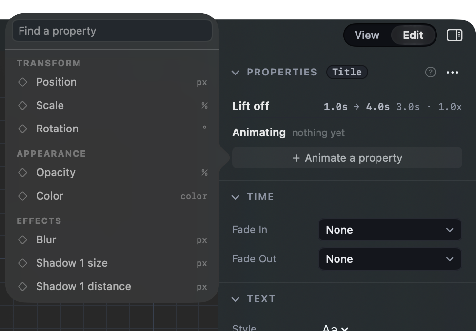
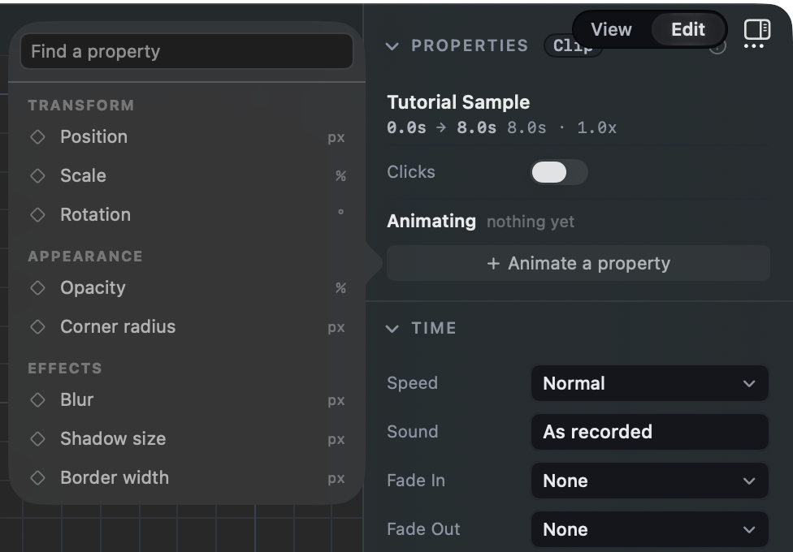

# How should Animate a property fit a long list?

## What this is

Pick a title or a clip in a video and the Properties panel has an
**Animate a property** button. It opens a small list of every value you can
put keys on: where it is, how big, how faded, its blur, its shadow, and so on.
Pick one and it starts animating at the playhead.

The video mock draws this list flat, in groups (Transform, Appearance,
Effects), in a box about 260 points tall:
[the video page](http://127.0.0.1:8791/index.html#video), Properties,
"Animate a property".

## What went wrong

The list grew from 8 values to 19 in one day. A typed title wears **two
shadows**, and each shadow has five values that can take keys (size, distance,
direction, color, opacity), so the shadows alone are ten rows. Border width and
color came in too.

The box is still 260 points tall, so only **8 of the 19** show. Shadow 1
color, all of Shadow 2, the Border and the whole Text group (Text size) are
below the fold. You only find them if you know to scroll or type the name.

A recording with a Border has the same problem: Border color, the four Crop
edges and Volume are all out of sight.

The mock lists one shadow value ("Shadow size") and never imagined a layer
with two shadows, so it does not say what to do here. Its own 13 rows would
scroll in its 260 point box too.

## The options

### A. One row per shadow and border, opening in place (recommended)

The list for a typed title would read:

- **Transform**: Position, Scale, Rotation
- **Appearance**: Opacity, Color
- **Effects**: Blur, Shadow 1 ›, Shadow 2 ›, Border ›
- **Text**: Text size

Ten rows instead of nineteen. Click **Shadow 2 ›** and its five values open
right under it; click one to animate it. The list grows tall enough to show
everything, up to the window's height, so on a normal window nothing scrolls.
Typing in Find a property still lists matching values flat ("shadow 2 color"
finds it directly).

This is how Premiere's Effect Controls panel works: every effect is one row
that folds open. It departs from the mock by adding the small arrow.

### B. Keep the flat list, let it grow

Nothing folds. The box grows to fit all its rows, up to the window's height.
A title shows all 19 at once. Closest to the mock's look, but the list is
long, ten of its rows are shadow values, and each extra shadow adds five more,
so it scrolls again on a smaller window or a layer with three shadows.

### C. Leave it as it is

The box stays short and scrolls; half a title's values stay below the fold.
Find a property already finds every value by name. Choosing this retires the
task.

## Either way

- Shadows keep the Effects list's own numbering: Shadow 1, Shadow 2.
- Every value that can take keys today stays reachable.
