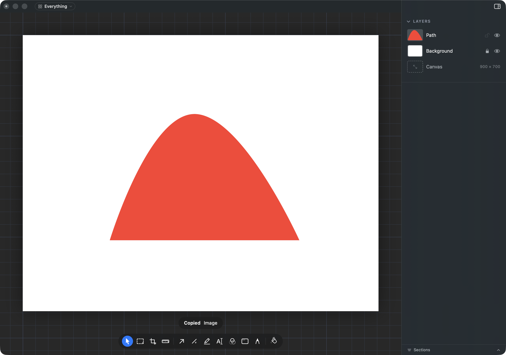

# Copy with the canvas: where does it go?

## What this is about

When you draw an icon on a new, blank canvas, the canvas is a sheet of white
under your drawing. On 2026-09-20 you decided:

> Copy leaves it out, holding Option copies it with.

**The first half shipped on 2026-09-30.** Press Copy Merged (Shift Command C)
on a drawing made on a blank canvas and what lands on the clipboard is just the
drawing, see-through everywhere else, the same picture Export saves by default.
A screenshot or a photograph still copies whole.

## Why the second half needs you again

On a Mac, a menu row that changes when you hold Option (like Finder's Close
Window turning into Close All) only works when the two rows share the same
letter, and the Option one adds Option to the shortcut. So "Copy Merged with
Background" would have to be **Option Shift Command C**.

That key already belongs to **Copy Look** (Layer menu), which copies one
shape's colours and borders onto another. We tried putting both on it: the
Option row takes the press and Copy Look stops doing anything. So one of them
has to give.

Until you answer, the white version is still available the long way: File >
Export, PNG, tick Include the background.

## The options

**A. A row of its own (recommended).** Edit shows Copy Merged, and under it
Copy Merged with Background on Control Shift Command C. Always visible, and no
key you already use moves. It is one more row in Edit, which is the clutter you
avoided with B.

**B. Hold Option, and Copy Look moves.** Exactly what you picked: hold Option
in Edit and Copy Merged becomes Copy Merged with Background on Option Shift
Command C. Copy Look and Paste Look move to Control Option Command C and V.

**C. Leave the white version to Export.** Copy never carries a blank canvas,
and the way to hand over an icon on its white is Export with Include the
background ticked. This ends the task: nothing more gets built.
