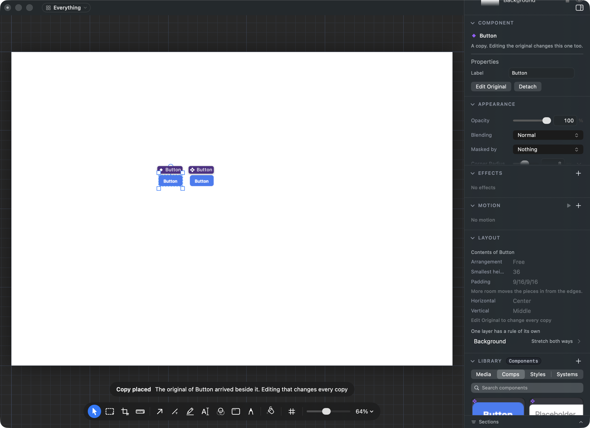
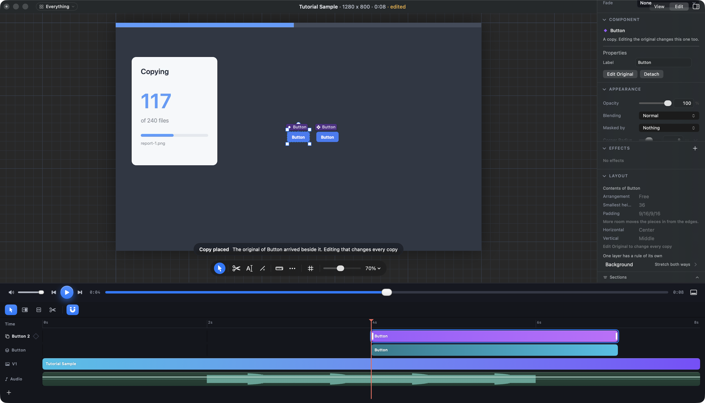

# Where a component's original goes when you drag it off the Library

## What you saw

You dragged a component (say, the Button) from the Library onto the canvas and two
Buttons appeared. It looks like the drop happened twice. It did not.

## What is actually happening

A component has one **original** and any number of **copies**. Change the
original and every copy changes with it. That is the "instance" you asked for.

When you drag a tile the document has not used yet, two things arrive at once:

- **the copy**, under your pointer, picked, which is what you asked for, and
- **the original**, standing one gap to the right, so there is something to edit.

Every drag of that tile after the first puts down just one copy.

This is how it has worked since 2026-09-22. It came from your answer to "When you
drag a component onto the canvas, should you get the original or a copy?": you
picked **Always a copy**, and that option's downside was "a drawing you did not
ask for appears beside your drop the first time". Seeing it in the app, that
downside reads as a double drop.

On a picture, the first drop takes the document from 1 layer to 3 (two Buttons and
the background):

On a video it is worse. The two Buttons get **two tracks** on the timeline:

Both arrive in one undo step, so one Undo takes both away.

## The choices

**A. Only the copy lands (recommended).** You get one drawing, one row in Layers and
one bar on the timeline. The original is kept with the document but is not part
of your picture. To change it you press **Edit Original**, on the copy or on the
Library tile. That opens the component on its own, with all of its looks side by
side, and **Done** brings you back. Figma and Sketch work this way for library
components. A component you make out of your own drawing stays where you drew it.

**B. The original lands hidden.** You see one drawing, but Layers gets a second,
hidden row for the original, and a video still gets a second, dimmed track. Showing
that row by accident puts the second Button back in your picture and your export.

**C. The original lands off the picture.** The original is set down in the grey
area outside the picture, so it never shows in an export. Layers still lists two,
a video still gets a second track, and Zoom to Fit brings the original into view.

**D. Keep both on the picture.** Nothing changes, and choosing this closes the task.

## Why A is recommended

B and C only move the second Button somewhere else. Layers and the timeline still
show two of everything. A is the only choice where one drag gives exactly one
thing. It also matches your note on the last card: "An Instance, not a copy.
Changes to the component change instances."
