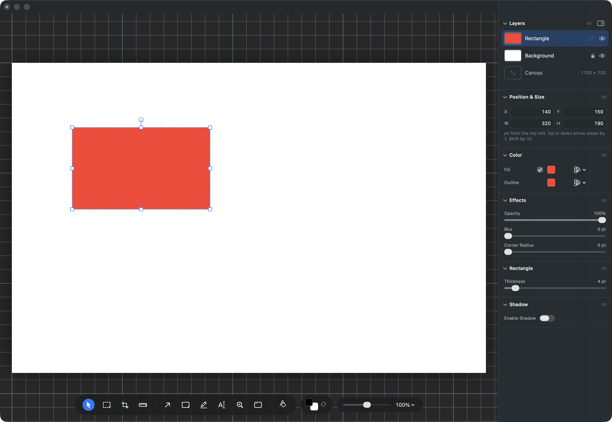
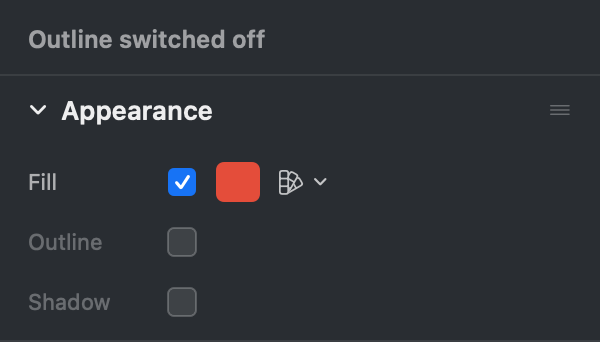
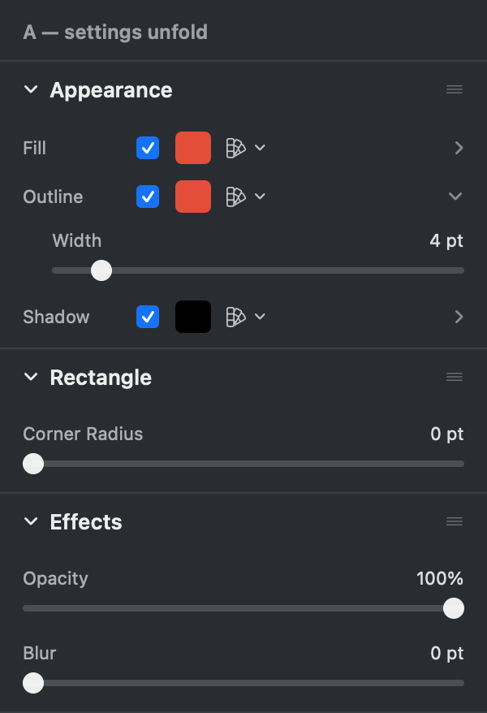
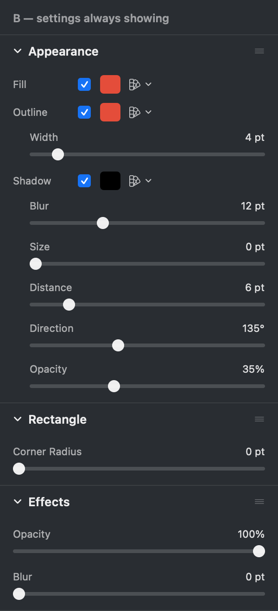
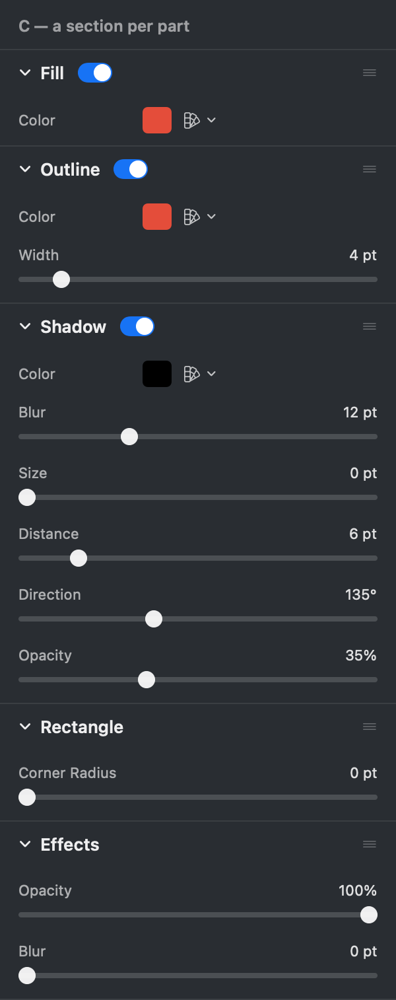

# A shape is made of parts: how should the list of them look?

## What this is about

Draw a rectangle in Photonz Next and pick it. Its settings are in the panel on
the right, and they are spread over four sections that do not agree with each
other. This is the real thing, photographed on 2026-09-06:

Read down the panel:

- **Color** has **Fill**, with a tick that turns it off, and **Outline**, with no
  tick at all.
- **Effects** has Opacity, Blur and **Corner Radius**.
- **Rectangle** has **Thickness**, which is the width of the outline whose
  colour is two sections above.
- **Shadow** is a section of its own with a switch inside it.

So the outline of a rectangle is described in three different places, and there
is **no way to take it off**. There is no tick beside it, and the width slider
stops at 1 point rather than 0. If you want a plain filled box with no edge, the
app has no move for you to make. That is what started this.

There are also three different ways of saying "this part is switched on": a tick
in a shared section, nothing at all, and a switch inside a section of its own.
Learning one teaches you nothing about the next, and every new part we add, an
inner shadow or a glow, would have to invent a fourth.

## The idea, which is the same whichever option you pick

**A shape is made of parts, and every part works the same way.**

A part is something the shape paints that can be absent: its **fill**, its
**outline**, its **shadow**, and later a **glow** or an **inner shadow**. Every
part has one tick that switches it on and off, and while it is on it shows its
colour and its own settings right there beside that tick. Switch it off and the
colour and the settings go away, leaving the tick and the name:

Nothing is lost by switching a part off. Switch it back on and it comes back
wearing what it had.

Three smaller things follow from that, and they are the same in all three
options:

- **Thickness becomes Width**, and it sits under the outline's colour. Nothing
  that sets the width of a line keeps a name that could mean anything.
- **Corner Radius leaves Effects** and joins the section named after the shape.
  It is not the outline's setting, because a box with no outline still has
  rounded corners, and it is not an effect laid over the top either. It
  describes the shape.
- **Effects keeps only what really is laid over the whole layer**: Opacity and
  Blur.

The same list appears for a picture, a frame, a label and a group, so the model
is a rule and not a special case for rectangles. On those, today's **Border**
becomes the **Outline** part, so there is one word for a ring round a layer
instead of two.

Nothing about how any drawing you already have looks will change. A rectangle
with a 4 point outline today opens with its Outline part on at 4 points.

## What is left to decide

Only how the list of parts is drawn. It changes the shape of every inspector in
the app, so it is your call. Here is the same rectangle, fill and outline and
shadow all switched on, drawn three ways at the same width as the real panel.

### Option A: one list, settings unfold

Three rows. Click one and its settings slide open under it; click another and
the first folds away. The panel never gets long. The cost is that the outline's
width, which is the number you drag most, is a click away, and two of the three
parts have nothing to open.

### Option B: one list, settings always showing (recommended)

The same three rows, with each part's settings sitting under it whenever the
part is on. Nothing to click, nothing hidden, and off visibly means off. The
cost is height: with a shadow on, the list is long and pushes the sections under
it down. That is softened by the fact that the whole thing is one panel section,
so it collapses with one click on its heading and can be dragged lower in the
panel.

This is the recommendation, because the thing that went wrong here was settings
being somewhere you could not see, and A puts two of them back behind a click.

### Option C: a section for each part

Fill, Outline and Shadow each become a panel section with a switch in its
heading, exactly the way Shadow is drawn today. It is the strongest statement
that the parts are peers, and it reuses a control you already know. The cost is
that a rectangle's panel goes from four headings to six, and the set of headings
changes every time you pick a different kind of layer, so the order you drag
your sections into stops holding still.

### Option D: leave it alone

Nothing moves and a rectangle's outline stays impossible to remove. Picking this
retires the task; it will not come back to be built.

## Worth knowing before you choose

- The list needs one name that never changes, because it speaks for everything
  you have picked at once: pick a rectangle and a screenshot together and one
  tick should reach both. The drawings call it **Appearance**. If you would
  rather it were called something else, say so in the answer.
- Shadow already works this way, so whichever option wins, Shadow is the part
  that changes least.
- The full written model, including which parts each kind of layer has and what
  counts as a part rather than a property, is in `docs/design/shape-parts.md`.
