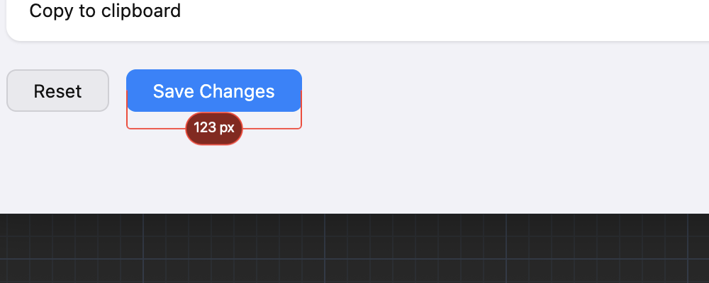
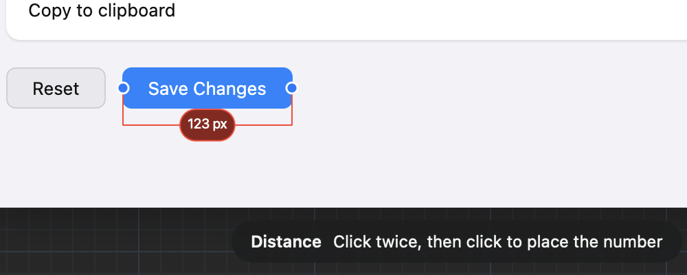
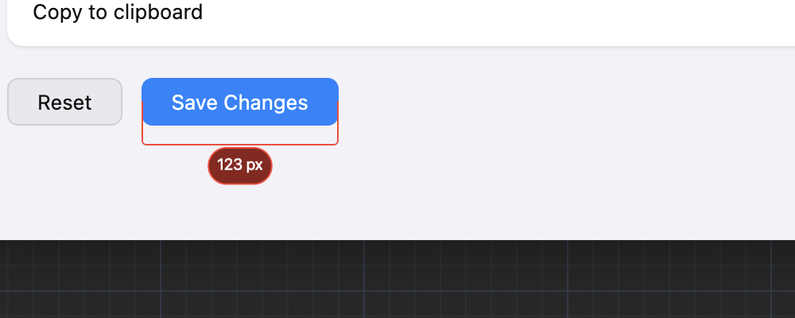

# Where a parked distance number lands

## What this is about

Measuring a distance in Photonz is three clicks. The first two say what you are
measuring: click the left edge of a button, click the right edge, and a red
caliper stretches between them. The third click parks the number somewhere out
of the way, and that is the one this is about.

Today that click becomes the **middle** of the number. So the number straddles
the spot you pointed at: half of it goes further away, and half of it grows back
toward the thing you just measured.

That is fine when you click somewhere open. It reads badly when you click into a
gap, because the gaps under real buttons are smaller than the number is tall.

## What you see today

That is the app, not a drawing: the width of a Save Changes button in a settings
capture, with the third click aimed 24 points below the button's bottom edge. The
number is 43 tall, so centring it there puts its top edge two and a half points
under the button. It reads as part of the button rather than as a note about it.

To get real air you would have to click about 45 points down instead of 24, and
nobody can judge "half the height of a number that is not on screen yet" by eye.

## What already changed, whichever way this goes

The number is now drawn under your pointer while you aim the third click, so you
can see the whole pill and where it will sit before you commit:

That fixes the surprise. It does not answer the question, because you can now
watch the number crowd the button and still have no comfortable spot to aim at.

## What each choice would feel like

### A. Leave it: your click is the middle

The picture above is the app. You aim lower to get air, and now you can at least
see how much lower.

Picking this retires the question for good rather than handing it back.

### B. Your click is the near edge

The number grows away from what you measured. Click 24 points under the button
and the **top** of the number lands there; the rest of it hangs below. Click
above instead and it is the bottom edge that lands on your click, and it grows
upward.

The gap you point into is the gap you get, every time, with no arithmetic. The
cost is that a click out in open space, where nothing was in the way, also puts
the number about half its height past where you pointed.

### C. Your click is the middle, but it never crowds what you measured

Your click still means the middle. The one time the number moves off it is when
it would come to rest right against the thing you just measured: then it slides
out far enough to leave a hair of air.

That air is not a new invention. Measuring the size of an element, or the gap
between two of them, already places the number with exactly this standoff, which
is why those two modes never had this problem. This makes a caliper you drew by
hand keep the same manners.

In the picture, the caliper's bar stays exactly where the click landed and the
number drops just below it. Out in open space nothing changes at all: the number
centres on your click, as it does today.

The catch is that the app can only keep clear of something it can see in the
picture. Measure across an empty stretch of canvas and there is nothing to stand
off from, so the click is simply the middle, which is the right answer there
anyway.

## Recommendation

**C.** It keeps the plain reading of a click, "put it here", for the common case,
and it only overrides that in the one case that looks wrong today. It also makes
all three ways of measuring leave the same amount of air, which is the thing that
makes a page of redlines look deliberate rather than assembled.

B is the simplest rule and a perfectly good answer if you would rather the app
never second-guess where you pointed.
