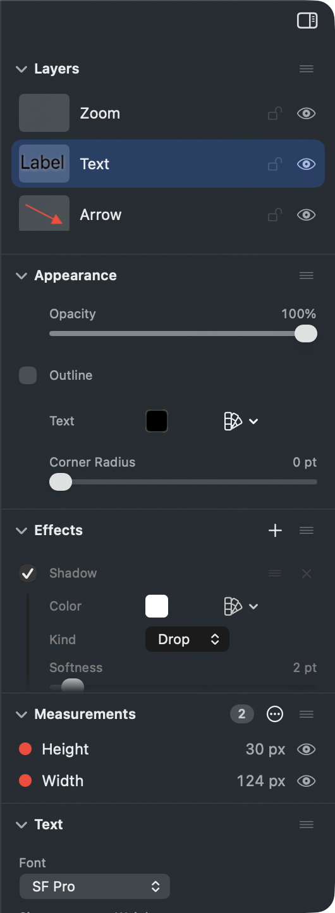

# When you pick something, where should its settings appear in the right hand panel?

## What this is about

The right hand panel is one long column of sections. Some are always there:
Layers at the top (the list of everything in the document), Appearance (what a
shape is: opacity, fill, outline, corner radius), Effects (what you have added
to it: shadows, borders, glow), Measurements (the list of measurements on the
picture) and Position and Size at the bottom.

One more section appears only when you pick a particular kind of thing. Pick a
piece of text and a **Text** section shows up with the font, the size and the
colour. Pick a measurement and a **Measurement** section shows up. Same for an
arrow, and for a zoom callout.

The question is where that section goes, because right now it goes below the
bottom edge of the window.

## What it looks like today

This is a real screenshot of the app, laptop sized window (1200 by 720), with a
marked up screenshot open and the Label text layer picked:

You picked the text. To change its size or its colour you scroll.

The panel has 688 points of room in this window. Measured off the app itself:

| Picked | Where its own section sits | Room |
| --- | --- | --- |
| A piece of text | Text at 602 to 778 | 688 |
| A measurement | Measurement at 502 to 781 | 688 |
| A zoom callout | Zoom Callout at 627 to 741 | 688 |
| A plain rectangle | no section of its own; Appearance at 169 to 431 | 688 |

So a plain rectangle is fine. Everything with settings of its own is cut off or
entirely below the edge.

## Why it is back

This was reported and fixed on 2026-09-06: the panel was made to say what you
picked before it explained itself, and the picked section sat third, at 344 to
520, whole on screen.

On 2026-09-07 you asked for Appearance and Effects to sit directly under Layers,
because they are the two you touch on every layer. That was done, and it pushed
the picked section from third place to fifth. The two asks pull in opposite
directions and there is not room on a laptop screen for both, so this is a
question about which one wins and how.

## What each option would look like

### What you picked sits at the top (recommended)

Order becomes Layers, then the thing you picked, then Appearance, then Effects.
On a plain shape nothing changes at all, because a plain shape has no section of
its own, so Appearance and Effects are still the first thing under Layers, which
is exactly what was asked for on 2026-09-07.

Doing the arithmetic on the measured heights:

| Picked | Its section | Appearance | Effects |
| --- | --- | --- | --- |
| Text | 169 to 345, whole | 345 to 546, whole | 546 to 691, last 3 points cut |
| Measurement | 169 to 448, whole | 448 to 613, whole | 613 to 694, last 6 points cut |
| Zoom callout | 169 to 283, whole | 283 to 509, whole | 509 to 654, whole |
| Rectangle | none | 169 to 431, whole | 431 to 512, whole |

The cost is honest and small: when something with its own settings is picked,
Appearance and Effects sit one section lower than they do today, and on the
tallest case the very bottom of Effects goes past the edge. Also, on a
measurement the Measurements list itself is pushed below the fold.

The gain is that nothing on screen moves when you click. The panel has one fixed
order you learn once, and the answer is already under your eyes.

### The panel scrolls itself to what you picked

The order stays exactly as it is now and the panel slides down when you click, so
the section lands on screen.

The problem shows up when you pick from the layers list rather than the canvas.
To bring Text fully into view the panel has to travel 90 points, which takes the
Layers header off the top and leaves about a row and a half of the list showing.
So the list you just clicked in slides mostly away under your pointer, and the
next thing you want to click has moved. Picking on the canvas does not have that
problem, but the motion on every single click is still motion you did not ask
for.

### The rest folds up while something is picked

Sections you are presumably not using close to just their title bars, so
everything fits.

The trouble is that the app has to guess what you are not using, and it will
guess wrong: putting a shadow on a label means wanting Effects open while text is
picked, which is the exact case this would fold shut. It also overwrites the open
and closed state you set by hand, so your own arrangement of the panel does not
survive a click.

### Leave it, scrolling is fine

Nothing changes and you scroll to reach the settings of the thing you just
picked. Choosing this retires the task rather than sending it back around.

## Worth knowing

Sections can be dragged into any order you like by their title bar, and that
arrangement is remembered. Whatever is chosen here is the arrangement everyone
starts from, not a cage.

A measurement's own section used to be 470 points tall, too tall to fit anywhere.
Its read-only numbers now fold away behind a Details control, which brought it
down to 279, and that is why it fits at all in the table above.

The numbers in the tables are arithmetic on section heights measured off the
running app. The panel also shortens its list sections when the whole column is
over-subscribed, so the real figures after the change may be a few points kinder
than these. They will not be worse.
