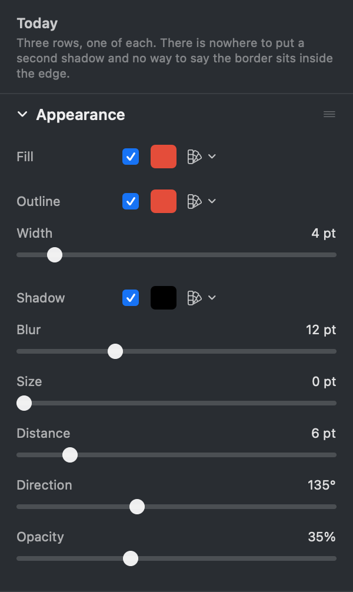
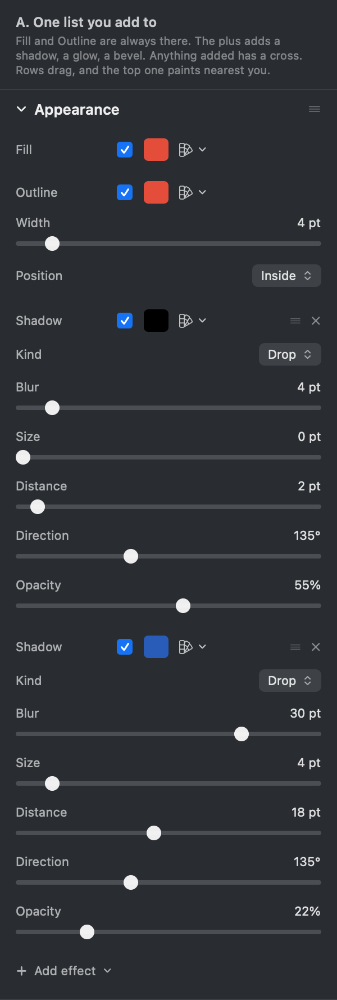
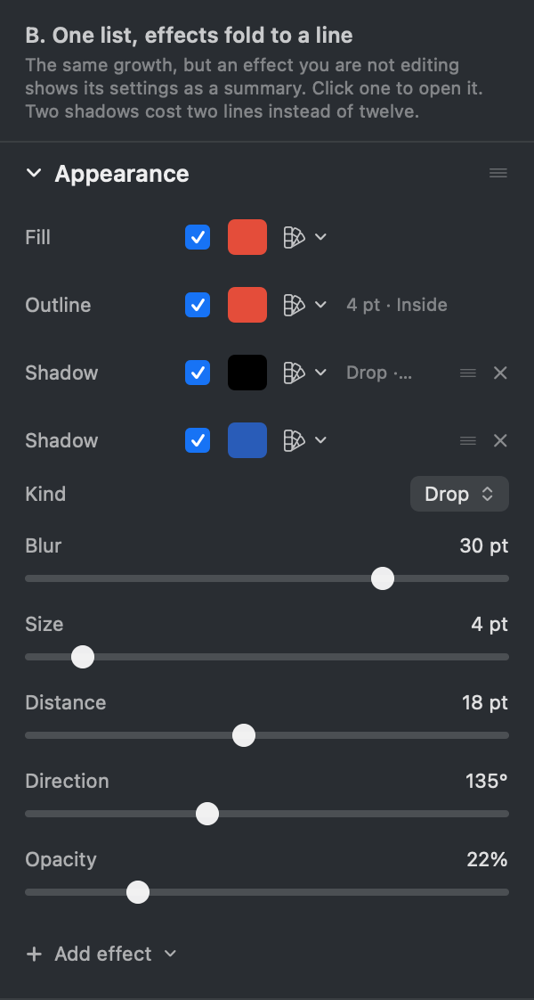
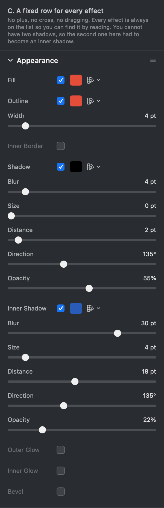

# How should the Appearance list grow?

## What this is about

Pick a rectangle in Photonz Next and the right hand dock shows a section called
**Appearance**. It holds three rows, each with a tick, the colour it paints, and
its own settings underneath: **Fill**, **Outline**, **Shadow**. One of each,
always in that order.

That is the whole list, and it is now the thing in the way. The effects people
reach for next do not fit in it:

- a border **on the inside** of the edge, and one **on the outside**
- a shadow thrown behind, and one cast **into** the shape
- a **glow**
- a **bevel**

Adding six more permanent rows is how a panel turns into a wall. This decision
settles the shape of the list before any of those get built, so the seventh
effect costs one entry and no new idea.

You are picking how the panel behaves, not how it is written.

## The two ideas underneath every option

**Inner and outer are a setting, not a different effect.** A border inside the
edge and one outside it are the same thing drawn in a different place, so they
are one row with a **Position** of Inside, Centre or Outside. A shadow behind
and a shadow cast inward are one row with a **Kind** of Drop or Inner. Four
names collapse to two rows.

**Some effects can be wanted twice.** Two shadows is the common one: a tight
dark shadow for contact and a wide soft one for lift. A fixed row cannot hold
two, so the list has to accept more than one of a kind.

Options A and B accept both ideas. Option C accepts the first and refuses the
second.

## Option A. One list you add to

Fill and Outline stay put. At the foot there is a plus, and its menu names what
you can add in the words you would go looking for: Shadow, Inner shadow, Glow,
Bevel. Anything you added wears a cross to take it away and a grip to drag it.
The row at the top is the one painted nearest you, so dragging a shadow above
the fill changes the picture.

Settings stay on screen while an effect is on, which is how the panel works
today and what you asked for on 6 September.

The picture is the honest cost: a shape with two shadows is about **890 points
of panel**, against 500 today, and you scroll the dock to reach the second
shadow's opacity.

## Option B. One list, and an effect you are not editing folds to a line

Same list, same plus, same cross, same drag. The difference is how much of it
is on screen at once. An effect you are not editing shows its settings as a
short summary on its own row, so the Outline row reads **4 pt · Inside** and the
first shadow reads **Drop · 4 pt**. Click a row to open it; one is open at a
time.

Two shadows cost two lines instead of twelve: about **560 points**, close to
what the panel is today. The catch is that it is a fold, and you asked for the
fold to go the day before yesterday. The difference from the one that was
removed is that this one shows the values on the closed row, so a folded effect
still answers the question you would have opened it to ask.

## Option C. A fixed row for every effect

No plus, no cross, no dragging. Every effect the app knows has a permanent row
with a tick: Fill, Outline, Inner Border, Shadow, Inner Shadow, Outer Glow,
Inner Glow, Bevel. You find an effect by reading the list.

You cannot have two of anything, so the shape in the picture could not have its
second drop shadow and had to take an inner shadow instead. And the list is
eight rows long even on a shape using two of them.

## What is decided either way

These do not change with your answer, so they are not on the card:

- **Nothing you have already drawn moves.** A picture's ring is already drawn
  inside its edge and a shape's stroke is already centred on its path, so
  Position starts at whatever each layer already has. Opening a file from last
  week paints it exactly as it did.
- **The tick still means off, not gone.** Switching an effect off keeps its
  colour and its numbers, so comparing with and without stays one click.
- **The plus menu says the full names.** Even though inner and outer are one
  row with a popup, the menu offers "Shadow" and "Inner shadow" separately,
  because that is what a person is looking for. Either one adds the same row
  with its Kind already set.

## Recommendation: A

It keeps the panel you use every day exactly as it is, it keeps the answer you
gave on 6 September, and the length only lands on someone who has deliberately
piled four effects onto one shape, which is also the moment they are editing
those four effects. B is the one to pick if the height in that picture looks
worse to you than a click does.

The written model, including what order means and how the next effect gets
added, is in `docs/design/shape-parts.md` under "How the list grows".
