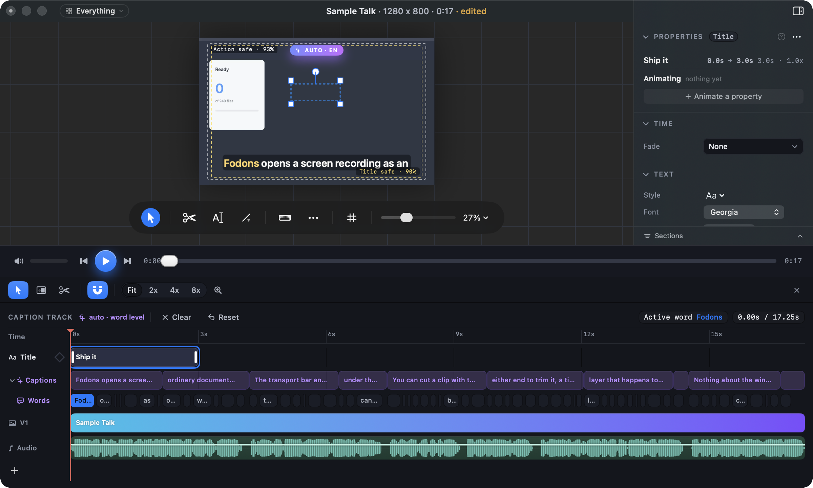

# Keeping Appearance and Effects on screen while editing video on a laptop

## What this is about

On 2026-09-20 you chose to **guarantee the fold**: whatever you pick, the
Appearance and Effects sections of the right hand panel are both whole on
screen, with no scrolling. On a picture that promise holds at every window size.

On a video it does not. The timeline runs the full width of the window, under
the panel as well as under the picture, just as the video mock draws it
([video mock](http://127.0.0.1:8791/index.html#video)). So every point of height
the timeline takes also comes off the panel.

## The numbers

Measured on the running app, in a laptop sized window (1200 by 720), with the
sample recording open:

| What is picked | Timeline | Panel height | Sections above Appearance | Appearance starts at |
| --- | --- | --- | --- | --- |
| The clip | closed to its bar | 583 | Properties, Time, Channel, Fades, Gain: 547 | 553 |
| The clip | open | **336** | the same 547 | 553 (below the bottom) |
| A title | open | **302** | Properties, Time, Text: 412 | 418 (below the bottom) |

Even if Appearance and Effects moved straight under Properties and were each
squeezed to two rows, a title would need 348 points and has 302. **No ordering
of the panel fixes this with the timeline open.** Either the panel gets height
back or the promise gives way on video.

In that picture the panel shows Properties, Time and the top of Text, and
nothing else. Appearance and Effects are further down.

## The options

**A. The panel runs the full height (recommended).** The panel goes from the
top of the window to the bottom, and the timeline sits under the picture only.
On a video, Appearance and Effects come straight under Properties. The panel
then has about 583 points, and both sections are whole for a clip and for a
title, with room to spare. The timeline keeps every track, but on a laptop it is
about a third narrower. This is a departure from the mock's layout, which is
why it needs your answer. Final Cut and Resolve run the timeline full width.
Premiere's default Editing layout does not: its timeline shares the bottom row
with other panels.

**B. The timeline opens shorter.** The layout stays exactly as the mock draws
it. On a small window the timeline opens only as tall as still leaves room for
Appearance and Effects, which move straight under Properties. On a laptop that
means two or three tracks show before the timeline scrolls, and the two sections
are drawn at their shortest, about two rows each, each scrolling inside itself.
Drag the timeline taller and the panel goes back to scrolling. A bigger window
pays none of this.

**C. Leave it scrolling.** Nothing changes. The promise holds on pictures and on
large windows. While you edit video on a laptop with the timeline open, you
scroll the panel to reach Appearance and Effects, or close the timeline to its
bar. Choosing this retires the task.

## Common to A and B

On a video, Appearance and Effects move up to sit straight under Properties.
The clip's own rows (Time, Text, the sound rows) move below them. On pictures
the order does not change.
