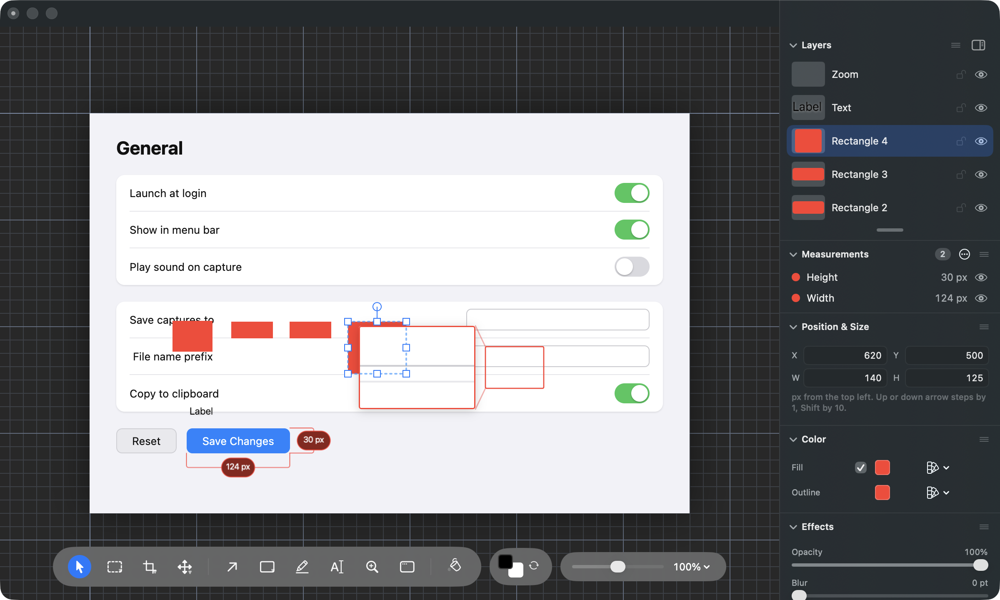

# The properties panel holds more than fits on a laptop

## What this is about

Photonz Next puts everything about the thing you have selected in the dock down
the right-hand side: the layers list, the measurements list, then a run of
sections — Position & Size, Colour, Effects, the settings that belong only to
the kind of thing you picked, and Shadow.

On a laptop-sized window (1200 by 720) that dock has 688 points of room. One
selected layer, on a screenshot with a few marks on it, brings between 890 and
1210 points of sections. So something is always below the fold. The only
question is what.

Today the part that falls off is the section named after the thing you picked.
Here is a rectangle selected, measured by a scripted walk rather than by eye
(`Scripts/playtest/dock-picked-first-walk.json`):

The dock's own numbers for that picture, in points from the top of the
scrolling area:

| Section | Where it sits | On screen? |
| --- | --- | --- |
| Layers | 6 to 257 | yes |
| Measurements | 257 to 344 | yes |
| Position & Size | 344 to 479 | yes |
| Colour | 479 to 584 | yes |
| Effects | 584 to 742 | starts, then runs off |
| **Rectangle** | **742 to 826** | **no, not even its title** |
| Shadow | 826 to 897 | no |

Two things are worth noticing. The Rectangle section is not merely cut off,
its heading is off screen too, so nothing on the panel hints that a rectangle
has settings of its own. And Effects is cut as well: the Corner Radius slider
sits about 120 points into Effects, which puts it at 704, sixteen points past
the bottom. Corner Radius was deliberately moved up on 3 September because
somebody reported having to scroll for it — and on any document with a
measurement in it, that fix has already stopped holding.

Picking a label, a measurement or a zoom callout is the same story, only worse:
the Text section sits at 749 to 925, the Zoom Callout at 749 to 863, and the
Measurement section at 674 to 1144.

## Why this cannot be fixed by shuffling the order

It is tempting to just move the picked thing's section up. Every arrangement
was worked through against the measured heights, and none of them clears the
list:

- Move it directly under the layers list and a rectangle and a zoom callout
  fit, but a piece of text does not leave room for Corner Radius (its own
  section is 176 points tall and Effects for text is 195).
- A measurement's section is 470 points tall on its own. The layers list is
  251. That is 721 before anything else is drawn, in a 688 point panel. No
  order fits it.

Reordering only chooses which part falls off the bottom. That is the choice
below.

## What you would experience under each option

**Put what you picked first.** You click a rectangle and, under the layers
list, the first thing you see is a section headed "Rectangle" with its
Thickness in it. Colour and Effects sit under that, and the X, Y, W and H
boxes under those. For a rectangle and a zoom callout everything you normally
reach for is on screen; for a piece of text, Corner Radius moves below the
fold. The panel never moves on its own.

**Take you to it instead.** Everything stays exactly where it is today, but
when you pick something whose own section is off the bottom, the panel slides
up just enough to show it — the layers list scrolls partly out of view — and
slides back when you deselect. If you have scrolled the panel by hand, it is
left alone, so working down in Effects on one shape and then clicking the next
one does not yank you anywhere. The cost is that the panel is no longer a
still thing: clicking around the canvas makes it shift.

**Make room: the lists start shorter.** The order does not change. The layers
list opens showing about three rows instead of five, the measurements list
likewise, and Shadow starts closed. That gives back roughly 150 points, which
is enough for a rectangle and a zoom callout to show their own settings with
nothing else moving down. A piece of text and a measurement still need a
scroll. Both lists can be dragged back to any height you like and the height
is remembered.

**Leave the panel as it is.** The scroll stays, and so does the fact that on a
marked-up screenshot you cannot see that the section exists at all.

## Recommendation

Put what you picked first. It is the same move the Component section got
yesterday, for the same reason — what you picked, then where it is, then what
it looks like — and it is the only option where the panel stays still. The
thing it costs, Corner Radius on a busy document, is already lost today, so
the trade is smaller than it first reads.

Whichever way this goes, the Measurement section being 470 points tall is a
separate problem and will get its own task.
