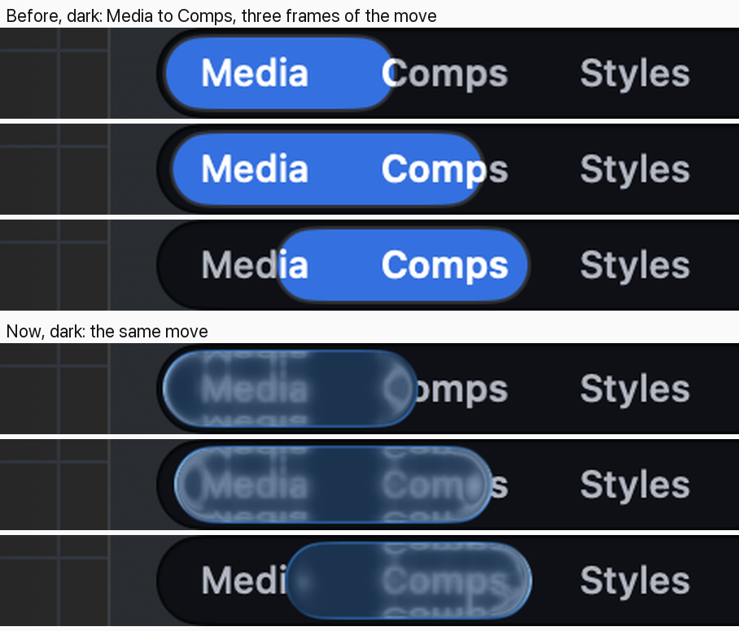
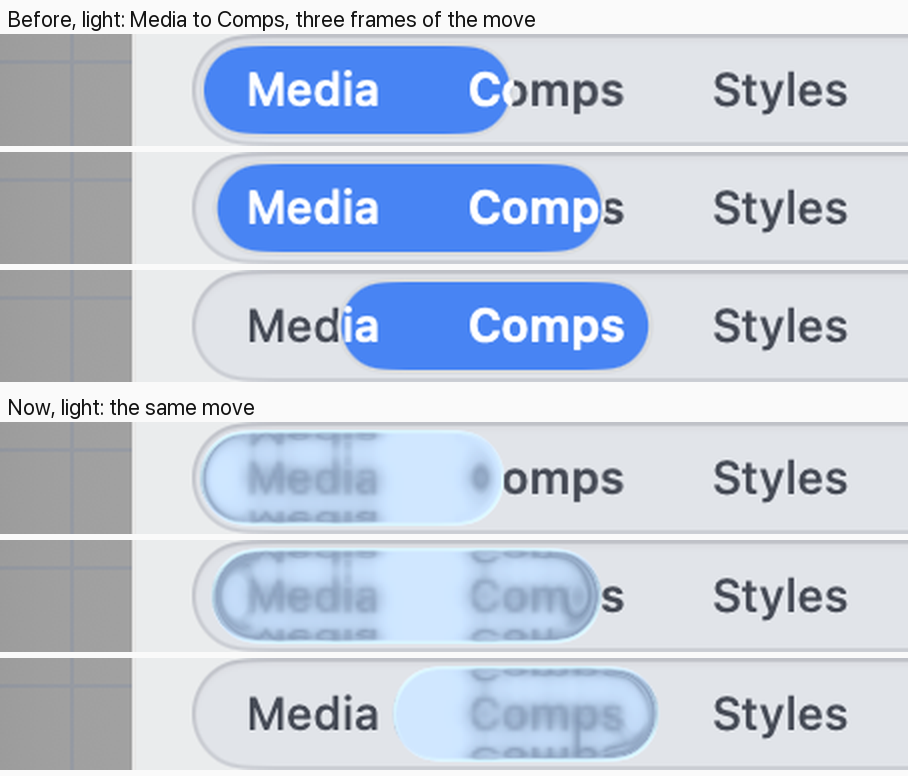
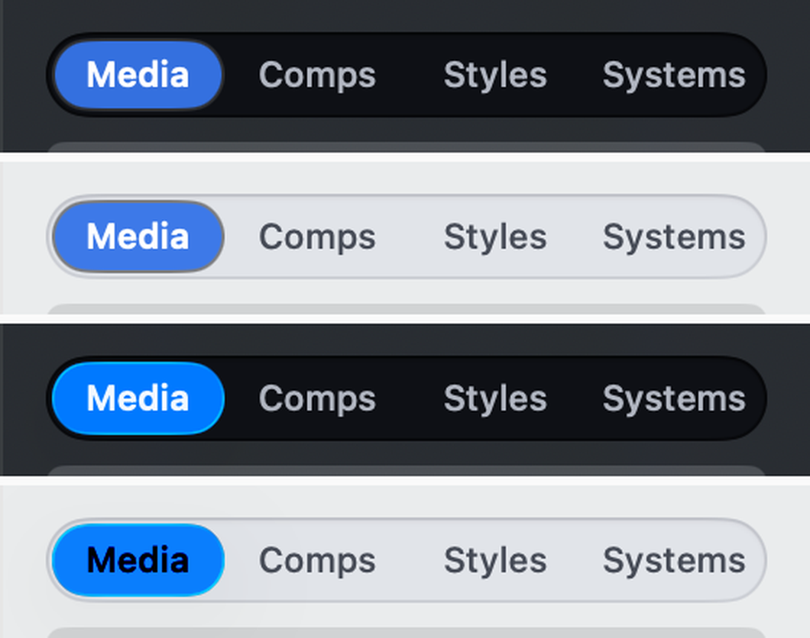

# Is this the Liquid Glass refraction you meant?

## What this is

The segmented control is the row of side-by-side choices used all over the
app: the Library's **Media, Comps, Styles, Systems**, the title bar's
**View | Edit**, the history bar's filter and the panel's rows. The picked
choice sits on a coloured **chip**.

You looked at the Library's row while the chip was moving and said: "I see no
liquid glass refraction on the edges." You were right. The chip was your
accent colour painted almost solid over a pane of glass, and it sat *behind*
the words on a solid grey rail, so the glass had nothing to bend.

## What changed

The chip is now the Mac's own tinted Liquid Glass with nothing painted over it.

- **At rest** it is the tinted glass, with the picked word inside it in the
  system's own label for glass: white in Dark, black in Light.
- **When you pick another choice** it lifts into a clear glass lens and slides
  *over* the words. They bend around its curved ends and mirror along its top
  and bottom rims as it passes. Then it lands as the tinted chip again.

## The move, frame by frame

Three frames of Media to Comps, before and now, enlarged. In the "now" frames,
look at "Comps" curving around the chip's end and the words mirrored along its
rims.

## At rest

Top two: before (painted blue). Bottom two: now (the system's tinted glass with
its light rim).

## Your options

- **Yes, this is it.** Keep the system's glass as filmed. The one thing to know:
  the words under the *middle* of the lens are frosted, not sharp, because that
  is how the Mac's clear glass draws. It lasts about a third of a second.
- **Crisp lens.** We draw the bending ourselves, so the words under the chip stay
  sharp and a little larger and bend only at its edges, like the iPhone's
  segmented thumb. The rim and tint stay the system's glass.
- **Stay tinted while it moves.** The chip keeps its blue the whole way across.
  Only its rim bends what is right at its edge, so there is much less to see.

## Also worth a look

- In **Light** the system puts a **black** word on the blue chip (it used to be
  white). The system chooses it, and it reads clearly.
- With the Photonz window **in the back**, the chip turns grey, the way every
  Mac control does.
