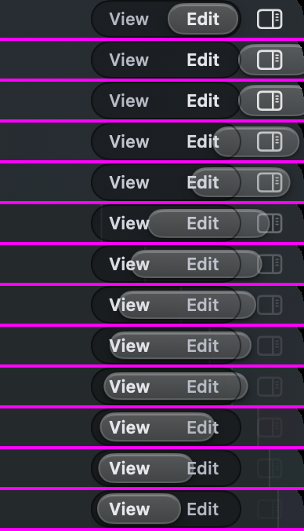
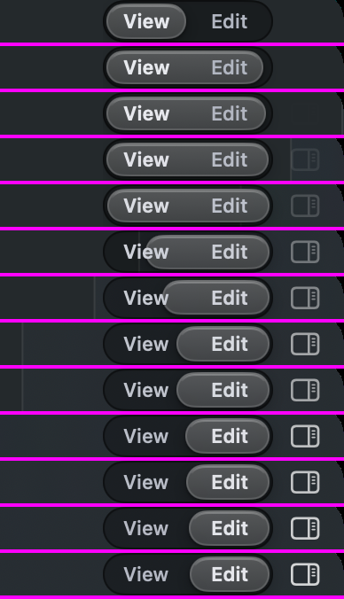
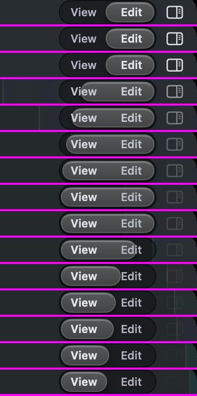

# How the segmented thumb should feel now that it glides

## What this is

A segmented control is the row of two to four options where exactly one is
picked: View | Edit in the title bar, Left / Center / Right under Across in
the panel, and about forty more across the app. The picked option sits on a
**thumb**, a lighter pane of glass under its word.

## What was wrong

On 2026-09-29 you found that the thumb "overshoots like CRAZY": clicking View
from Edit threw it right past the rail and onto the panel toggle, and the other
way it was cut off at the rail's end. That was filmed frame by frame from the
real window before anything was changed:

The title bar switches View and Edit inside an animation, and that animation
moved the thumb on top of its own glide, so the distance was counted twice.

## What it does now

Every segmented control uses one motion: the glass glides to the new option in
about three tenths of a second and stops. On the way its leading edge reaches
the new option first, so for a moment it spans both a little squashed, then the
trailing edge follows it in. It never goes past the option and never bounces.
This is the same motion as the component page
(http://127.0.0.1:8791/pages/comp-segmented.html, "Changing the value").

View to Edit, one row per frame from the real window:

Edit to View:

## The options

- **Keep this glide.** Nothing changes.
- **A plain slide.** No stretch at all: the glass keeps its size and slides,
  like the system control.
- **Quicker glide.** The same move in about two tenths of a second.

Whichever you pick, the thumb stays inside its rail in every frame. A walk films
it and fails if it ever leaves.
