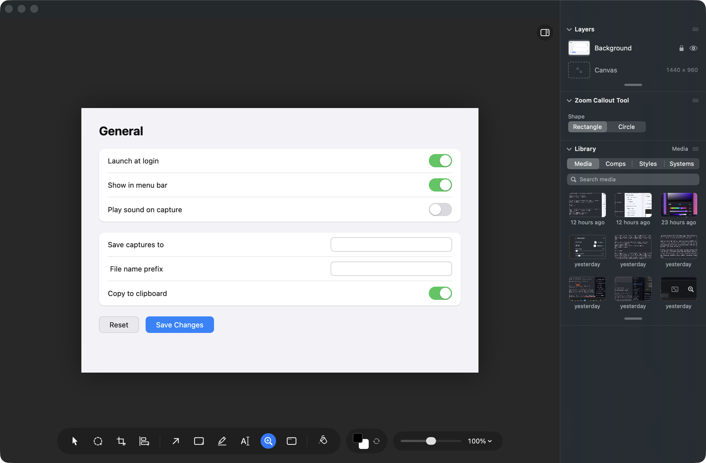
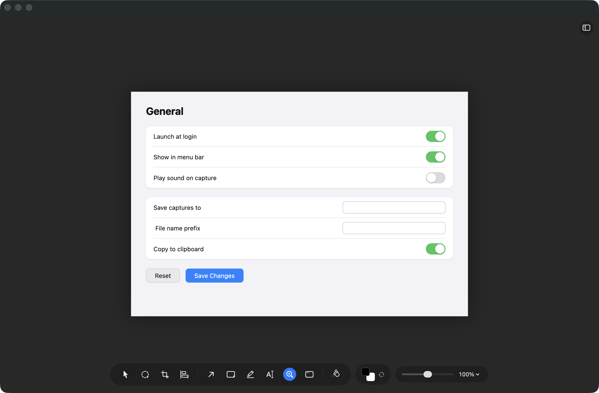
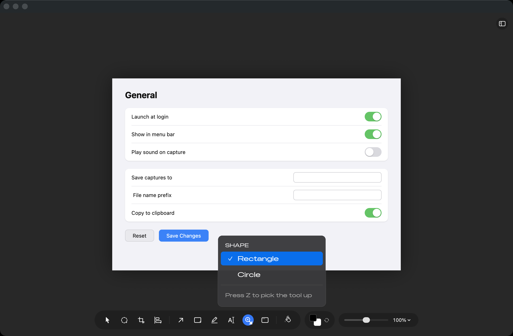
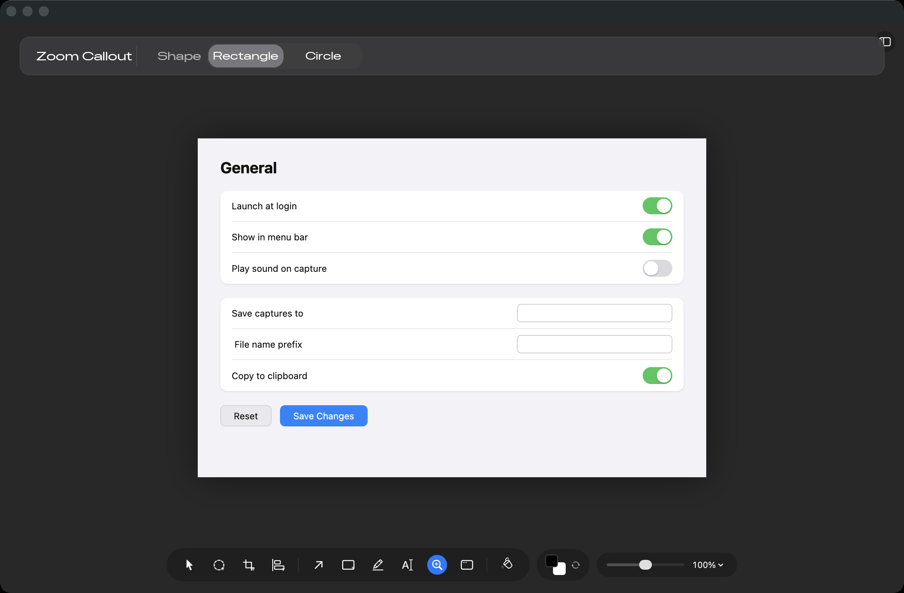
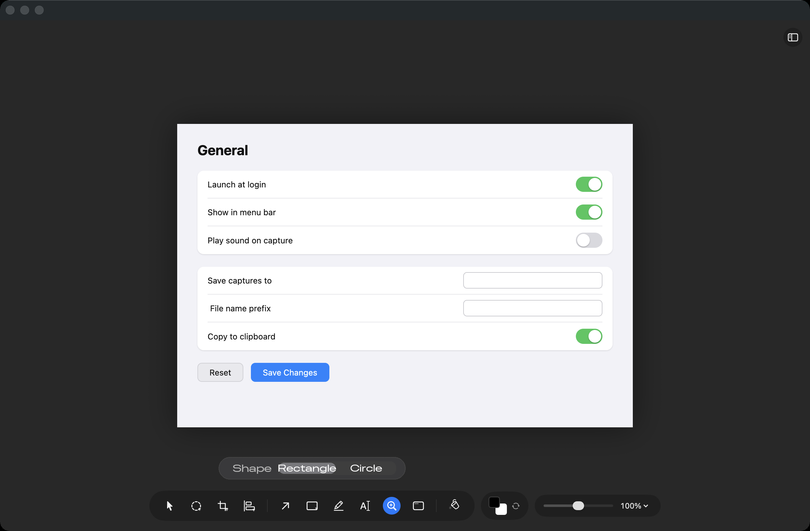

# Where do a tool's own settings live when the panel is hidden?

## What this is about

Photonz (release Next) has a floating tool bar along the bottom of the editor
window and a docked panel down the right hand side. Some choices belong to the
**picture** or to a **layer you have picked** (its colour, its size, its
shadow), and those live in the panel. Other choices belong to the **tool in
your hand**, before you have drawn anything at all:

- the Zoom Callout's **Shape**, box or circle, which decides what the next
  callout you drag out looks like
- the Magic Wand's **Tolerance**, how far a colour may drift and still be
  included when you click
- Measure's **Snap** (what a measuring point sticks to) and **Show** (which
  measurements the picture draws)
- Crop's **aspect lock**, and Measure's **mode**

Right now the first three sit only in the right hand panel. The last two do
not: those tool buttons carry their own choice.

## What it looks like today

Pick up the Zoom Callout tool with Z. With the panel showing, a **Zoom Callout
Tool** section appears in it with the Shape choice:

Hide the panel (the button at the top right, or Option Command L) and the
choice is simply gone. There is no wedge on the Zoom Callout button, no menu,
nothing:

That matters more than "you can just show the panel again", because **the panel
also hides itself**: on a narrow window it collapses on its own, so a person can
lose the Shape choice without ever having pressed anything.

Meanwhile, look at the tool bar in that second picture with Crop selected
instead. The Crop button wears a **small wedge in its bottom right corner**, and
pressing and holding it opens its four aspect locks. Measure's button does the
same for its modes. So half the tool bar already solves this problem and half
does not, which is really what this decision is about: **which half does the
rest of the app follow?**

## Option A: in the tool button (recommended)

Press and hold the tool you are holding, or click its corner wedge, and a short
list opens above the tool bar carrying that tool's settings. The Zoom Callout
grows a wedge and a **Shape** list; the wand grows one for **Tolerance**;
Measure's existing list gains **Snap** and **Show** under its modes.

You would learn one gesture, and it is the one Crop and Measure already taught
you. Nothing new is on screen until you press something, so the picture keeps
every pixel it has now, and it behaves the same on a narrow window where the
panel has hidden itself.

The honest cost: you cannot **see** where a setting stands without pressing and
holding first, and the wand's Tolerance is a slider today, which does not fit in
this kind of list. It would become a short set of steps, or plus and minus, and
keep its slider in the panel.

## Option B: a strip across the top

A thin bar under the title bar, always open, showing the settings for whatever
tool is in your hand. This is Photoshop's options bar and most editors have one.
Everything is visible without pressing anything, and a real slider fits, so
Tolerance keeps the control it has.

The cost is that it is permanent chrome across the top, present even when the
tool in hand has one setting or none, and it makes a third place tool
information lives (bar, strip, panel). It also comes and goes as you change
tools.

## Option C: a capsule above the tool bar

The same always-open row as B, but floating just above the tool bar, right over
the button you clicked.

The cost is that it covers the bottom of the picture, which on a screenshot is
often exactly where the buttons you are redlining sit. There is also history
here: tool settings used to live **inside** the tool bar and made it 150 to 200
points wider the moment you picked up Measure or Crop, which pushed it off a
narrow picture. That is why they were moved out in the first place, on
2026-08-23.

## Option D: leave it as it is

Tool settings stay panel-only. Nothing new to learn and nothing new on screen,
but on a narrow window these settings can still vanish on you, and the tool bar
keeps contradicting itself. **Picking this retires the task for good.**

## One more thing this decision settles

The design notes currently disagree with themselves. Section 6 of
`docs/design/mocks/shared/UX-PATTERNS.md` says tool options are "shown in the
options bar or the top of the Inspector", and there has never been an options
bar. Rule D15, further down the same document, says the opposite: modes live in
the tool button and settings live in the panel. Whichever option wins, that
section 6 line gets rewritten to match, in the same change, so the two stop
disagreeing.

## Where to look

The surface is the editor window in Photonz Dev with release **Next** selected
in the Experiments window. Press Z for the Zoom Callout, W for the Magic Wand,
I for Measure, C for Crop, and Option Command L to hide and show the panel.
