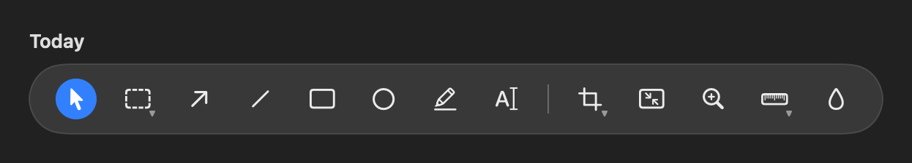
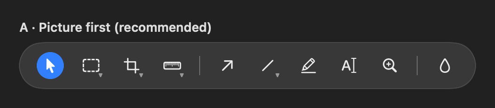
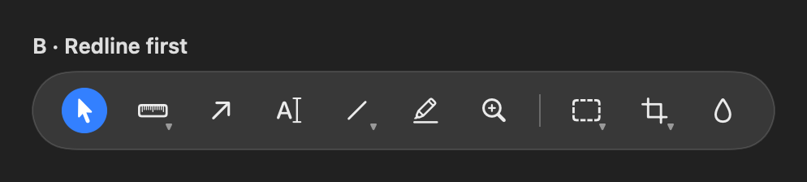
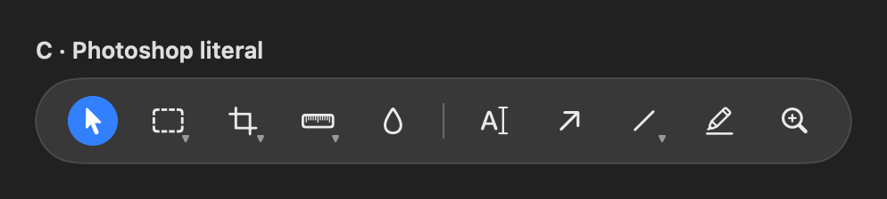
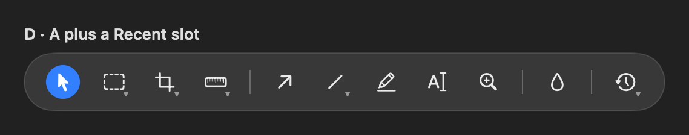

# The tool bar's families: which order, and is a Recent slot worth a slot?

## What this is

The floating tool bar at the bottom of the editor window (Photonz Dev, release Next). It used to be thirteen buttons in no particular order: the three selection tools shared one menu, but the shapes did not, the measuring tools did not, and the paint bucket sat alone at the end. It also mixed two idioms for "there is more inside this button": a detached chevron on the selection slot, and a small corner wedge on Crop and Measure.

It is now ten slots in three families, separated by hairlines, all using the corner wedge. A family button wears the tool you used last in that family, a click picks that tool up, press-and-hold lists the family, and shift plus any of the family's letters cycles through it. Resize Image is not a tool, so it left the bar; it rides at the foot of the Crop button's list and stays in the Image menu.

Before (today's Current, and Next before this change):

## Option A: Picture first (recommended, and what is built)

Select · Selection · Crop · Measure | Arrow · Shapes · Highlight · Text · Zoom Callout | Fill

Left to right it reads as what you do to a picture: pick it, cut it, measure it; then draw on it; then paint it, with Fill beside the color pair it uses. Measure is fourth, two slots from Select. Arrow leads the drawing family and never hides inside a group, because it is the redline tool people reach for most. This follows Photoshop's principle (families, one slot per family, the last member remembered) rather than its literal sequence, since Photoshop has no arrow, highlight or zoom callout to place.

## Option B: Redline first

Select · Measure · Arrow · Text · Shapes · Highlight · Zoom Callout | Selection · Crop · Fill

The redline tools lead, the pixel-editing tools trail as one family. Measure and Arrow sit right after Select. A Photoshop hand reaching for the second slot expecting the marquee finds the ruler.

## Option C: Photoshop literal

Select · Selection · Crop · Measure · Fill | Text · Arrow · Shapes · Highlight · Zoom Callout

Photoshop puts the paint bucket before type and shapes, and type before shapes. Fill ends up a whole family away from the color pair it acts on.

## Option D: Option A plus a Recent slot

A clock button at the far end that wears the tool you used before this one and lists the last three. My reading: every tool is already on the bar and each family button already remembers its last member, so this slot would show a tool that is also somewhere else, spend the width the regrouping just saved, and move around, which is the opposite of the predictability the families are for. If it earns a place at all, it is on a narrow window where tools have overflowed into the "more" menu.

## Keys, whichever order wins

Every tool keeps its letter: V select, M selection (W wand), C crop, I measure, A arrow, L line, R rectangle, O ellipse, H highlight, T text, Z zoom callout, G fill. Shift plus a family letter cycles the family (Shift M, Shift W; Shift L, Shift R, Shift O). The order only changes where a tool sits for the mouse.

## What is measured

At a 1280 point window the tools span 561 points before and 422 points after, 139 points narrower, with nothing in the overflow menu. Picking up Crop, a shape or the wand leaves the bar the same width.
