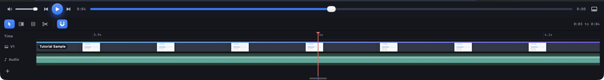
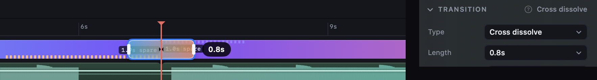
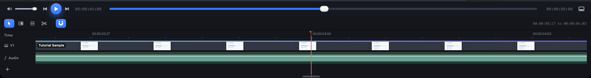
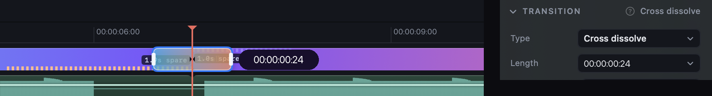
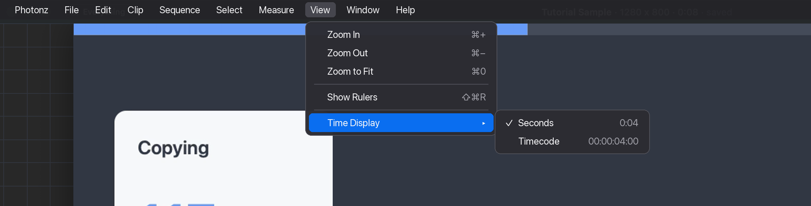

# How should time on a video read: seconds, or frames?

## What this is about

A video is a run of still pictures, usually 30 a second. Editors in Premiere and
Final Cut think in those pictures, called frames. They trim a dissolve to
"12 frames" and park the playhead at **00:00:04:12** (hours, minutes, seconds,
then the frame within that second). That label is called timecode.

Photonz reads time in seconds everywhere on a video. That is friendly, but it
means an editor cannot land on a frame they can name, and two readouts can
round the same moment differently.

The places that show time:

- **The transport** under the picture: the time of the playhead and the video's length.
- **The ruler** across the top of the timeline, which counts finer as you zoom in.
- **The bubble** beside the pointer while you drag the end of a transition.
- **The Length row** in the Transition section of the panel.

The video mocks draw seconds throughout
(http://127.0.0.1:8791/index.html#video-transition-wt says "1.0s", the document
"0:18"), so frames by default would be a departure from them. That is why this
is your call.

## What it looks like today (reproduced 2026-10-02, Next, nothing switched on)

The transport says **0:04**. Zoomed in as far as the timeline goes, the ruler
counts **3.9s, 4s, 4.1s**.

Dragging a transition's end, the bubble says **0.8s**, and so does the panel's
Length row.

## Option A: timecode everywhere

Every time on a video reads as timecode, as in Premiere. The transport says
00:00:04:00 and the video's length 00:00:08:00. The ruler labels its marks in
timecode and, zoomed right in, shows a tick for every frame. The bubble and the
Length row say 00:00:00:24, which is 24 frames.

These pictures are the real window with the numbers painted over, not the app
running. Expect the long numbers to take room from the scrub bar.

## Option B: seconds stay, Timecode is a choice in the View menu (recommended)

Nothing changes until you ask for it. **View, then Time Display** offers
**Seconds** (the default, today's look) and **Timecode**. Picking Timecode turns
every readout listed above over at once, so they look like Option A. Premiere
offers the same choice.

The menu is drawn over the window, not the app running.

Whichever display is showing:

- dragging a transition's end or a trim lands on a whole frame, so the bubble
  and the panel always agree;
- typing **12f** or **00:00:00:12** into a length box gives the same 12 frames.

## Option C: leave it as it is

Time keeps reading in seconds and nothing about frames appears. This retires
the task.

## Why B is recommended

Most people trimming a screen recording think in seconds, and the mocks draw
seconds. The editor who wants frames gets them from one menu row, once, and
from then on everything agrees to the frame. A, by contrast, puts long numbers
in front of everyone to serve the people who would have found the setting.
