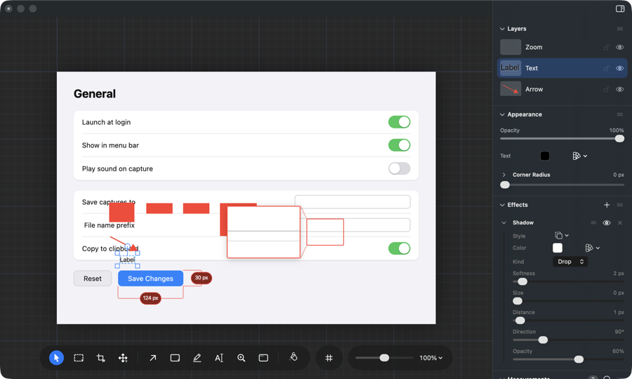
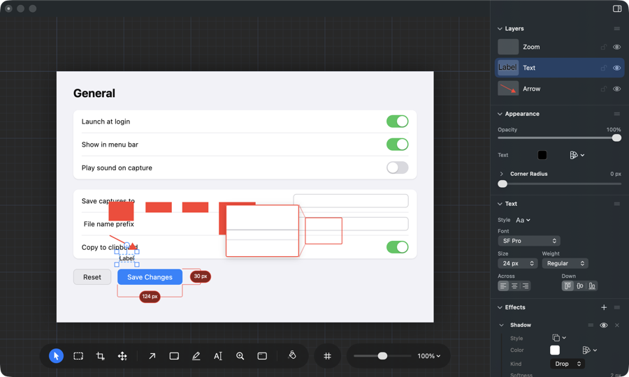

# When the panel runs out of room, what goes below the fold?

## What this is about

The right-hand panel is a stack of sections. Some are always there (Layers,
Appearance, Effects, Measurements, Position & Size) and one is named after the
thing you just clicked: Text for a piece of text, Measurement for a measurement,
Zoom Callout for a callout, Arrow for an arrow.

In a short window they do not all fit. Measured on the app at 1200 by 720, the
panel is 688 points tall and the sections come to about 1090. Roughly four
hundred points have to go below the fold, and the question is which four hundred.

## What you see today

That is the app, not a drawing. A screenshot marked up with four rectangles, an
arrow, a label and a zoom callout, with the label picked. The panel shows Layers,
Appearance, and then Effects with a shadow opened in it, and that is the whole
window. The Text section, which is where Font, Size, Weight and alignment live,
starts 72 points past the bottom edge, so there is not even a heading to tell you
it exists.

The same thing happens to a zoom callout. A measurement gets its heading on
screen but is cut across the middle.

## Why it went this way

Two things you asked for are pulling against each other.

On **6 September** you picked "Put what you picked first", because the sections
named after the thing you clicked used to trail Colour and Effects and fell off
the bottom of the panel.

On **7 September** you asked for Appearance and Effects to sit directly under
Layers, in that order, because they are the two people touch on every layer.

Both were the right call on their own. Together they put about 340 points of
always-there sections between the layers list and the thing you clicked, and in a
short window that is more than the panel has.

The shadow in the picture is doing most of the damage. A piece of text carries a
drop shadow so it stays readable, that shadow is open by default, and the panel
keeps room for an effect that is open, so it takes 300 of the 688 points.

## What each choice would feel like

### A. What you picked goes above Effects

That is the app too, with the change tried on the probe. Layers, Appearance, then
Text whole, then Effects starting underneath with its shadow. Opacity and Fill
have not moved. The shadow sliders are now the thing you scroll for.

Tried on all five kinds of layer in a 720 point window: the section named after
what you picked is whole on screen every time, and the Effects heading is on
screen every time.

### B. What you picked goes first, above everything

Layers, then Text, then Appearance, then Effects. The strongest reading of "put
what you picked first". It also fits, but Opacity and Fill move down by a whole
section whenever the thing you clicked has settings of its own, so where Opacity
lives depends on what you have selected.

### C. Leave the panel as it is

The first picture stays true. Text settings, and a zoom callout's settings, are
off the bottom with no heading in a short window. In a tall window they do fit,
so this only bites when the window is short.

## What happens either way

A scripted check called `dock-picked-first-walk` has been failing on every run
since the 7 September change, because it checks exactly this promise. Whichever
way this goes, that check gets put back in step with what the panel does, so a
new break stops hiding behind an old one.
